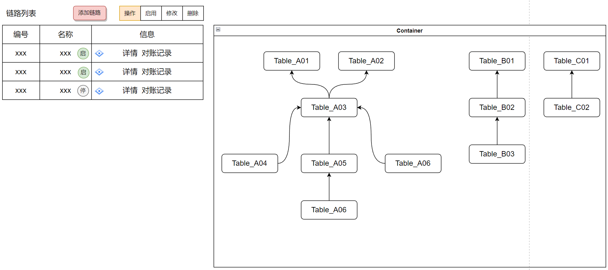

近期的一个需求，要求实现以下功能：

> 1. 左侧表格展示数据的对应关系，右侧根据后端返回的数据实现右侧的 DAG 有向无环图

</br>

#### 方法一：通过 AntV X6 的 DAG 有向无环图实现

[链接：](https://x6.antv.antgroup.com/zh/examples/showcase/practices/#dag)

方法：

```js
npm install @antv/x6 --save
```

```vue
<template>
    <div style="width=100%; height=100%">
        <div id="container"></div>
    </div>
</template>
<script lang="ts">
import { Graph } from '@antv/x6'
// import { Snapline } from '@antv/x6-plugin-snapline'
import { onMounted } from 'vue'
import { nodes, edges } from './data'
export default {
    setup() {
        onMounted(() => {
            // const data = {
            //     // 节点数据
            //     nodes: [
            //         {
            //             id: 'node1',
            //             shape: 'rect',
            //             x: 40,
            //             y: 40,
            //             width: 100,
            //             height: 40,
            //             label: 'hello',
            //             // attrs 属性来定制节点和边的样式
            //             attrs: {
            //                 // body 是选择器名称，选中的是 rect 元素
            //                 body: {
            //                     stroke: '#8f8f8f',
            //                     strokeWidth: 1,
            //                     fill: '#fff',
            //                     rx: 6,
            //                     ry: 6,
            //                 },
            //             },
            //         },
            //         {
            //             id: 'node2',
            //             shape: 'rect',
            //             x: 160,
            //             y: 180,
            //             width: 100,
            //             height: 40,
            //             label: 'world',
            //             attrs: {
            //                 body: {
            //                     stroke: '#8f8f8f',
            //                     strokeWidth: 1,
            //                     fill: '#fff',
            //                     rx: 6,
            //                     ry: 6,
            //                 },
            //             },
            //         },
            //     ],
            //     // 边数据
            //     edges: [
            //         {
            //             shape: 'edge',
            //             source: 'node1',
            //             target: 'node2',
            //             label: 'x6',
            //             attrs: {
            //                 // line 是选择器名称，选中的边的 path 元素
            //                 line: {
            //                     stroke: '#8f8f8f',
            //                     strokeWidth: 1,
            //                 },
            //             },
            //         },
            //     ],
            // }
            const graph = new Graph({
                container: document.getElementById('container'),
                //画布大小自适应
                autoResize: true,
                width: 800,
                height: 600,
                // 通过 background 和 grid 两个配置来设置画布的背景以及网格。
                background: {
                    color: '#F2F7FA',
                },
                grid: {
                    visible: true,
                    type: 'doubleMesh',
                    args: [
                        {
                            color: '#eee', // 主网格线颜色
                            thickness: 1, // 主网格线宽度
                        },
                        {
                            color: '#ddd', // 次网格线颜色
                            thickness: 1, // 次网格线宽度
                            factor: 4, // 主次网格线间隔
                        },
                    ],
                },
                // panning,mousewheel实现画布的平移和缩放
                panning: true,
                // mousewheel: true,
                mousewheel: {
                    enabled: true,
                    modifiers: 'Ctrl',
                },
            })
            const obj = {}
            nodes.forEach((item) => {
                item.shape = 'rect'
                item.width = 80
                item.height = 40
                obj[item.label] = graph.addNode(item)
            })
            edges.forEach((item) => {
                item.shape = 'edge'
                item.source = obj[item.source]
                item.target = obj[item.target]
                graph.addEdge(item)
            })
            // const rect = graph.addNode({
            //     shape: 'rect',
            //     x: 100,
            //     y: 200,
            //     width: 80,
            //     height: 40,
            //     label: 'rect',
            // })

            // const circle = graph.addNode({
            //     shape: 'circle',
            //     x: 280,
            //     y: 200,
            //     width: 60,
            //     height: 60,
            //     label: 'circle',
            // })

            // const edge = graph.addEdge({
            //     shape: 'edge',
            //     source: rect,
            //     target: circle,
            // })
            // graph.fromJSON(data) // 渲染元素
            // graph.centerContent() // 居中显示
            // 对画布的一些操作
            // graph.resize(800, 600) // resize 画布大小
            // graph.translate(20, 20) // 在 x、y 方向上平移画布
            // graph.zoom(0.2) // 将画布缩放级别增加 0.2（默认为1）
            // graph.zoom(-0.2) // 将画布缩放级别减少 0.2
            // graph.zoomTo(1.2) // 将画布缩放级别设置为 1.2
            // // 将画布中元素缩小或者放大一定级别，让画布正好容纳所有元素，可以通过 maxScale 配置最大缩放级别
            // graph.zoomToFit({ maxScale: 1 })
            // graph.centerContent() // 将画布中元素居中展示
            // 画布对齐线
            // graph.use(
            //     new Snapline({
            //         enabled: true,
            //     })
            // )
            // graph.prop('size', { width: 120, height: 50 }) // 修改 x 坐标
            // graph.attr('rect/fill', '#ccc') // 修改填充色，等价于 source.prop('attrs/rect/fill', '#ccc')
        })
    },
}
</script>
```

data.js

```js
export const nodes = [
    {
        x: 100,
        y: 200,
        label: 'Table_A01',
        id: 'Table_A01',
    },
    {
        x: 300,
        y: 200,
        label: 'Table_A02',
        id: 'Table_A02',
    },
    {
        x: 200,
        y: 300,
        label: 'Table_A03',
        id: 'Table_A03',
    },
    {
        x: 0,
        y: 400,
        label: 'Table_A04',
        id: 'Table_A04',
    },
    {
        x: 200,
        y: 400,
        label: 'Table_A05',
        id: 'Table_A05',
    },
    {
        x: 400,
        y: 400,
        label: 'Table_A06',
        id: 'Table_A06',
    },
    {
        x: 200,
        y: 500,
        label: 'Table_A07',
        id: 'Table_A07',
    },
]
export const edges = [
    {
        source: 'Table_A03',
        target: 'Table_A01',
    },
    {
        source: 'Table_A03',
        target: 'Table_A02',
    },
    {
        source: 'Table_A04',
        target: 'Table_A03',
    },
    {
        source: 'Table_A05',
        target: 'Table_A03',
    },
    {
        source: 'Table_A06',
        target: 'Table_A01',
    },
    {
        source: 'Table_A07',
        target: 'Table_A05',
    },
]
```

#### 方法二：通过 D3 实现流程图

[链接：](https://blog.csdn.net/weixin_47319740/article/details/108408172)
方法：

```js
npm install d3

npm install dagre-d3
```

代码：

```vue
<template>
    <div style="border: 1px solid #ccc; padding: 20px; width: 600px">
        <svg class="dagre" width="1600" height="1000">
            <g class="container"></g>
        </svg>
    </div>
    <!-- <div ref="tooltip" class="tooltip">
        <div>节点ID：{{ currentNode.id }}</div>
        <div>节点名称：{{ currentNode.nodeName }}</div>
    </div> -->
</template>
<script lang="ts" setup>
import { Graph } from '@antv/x6'
import { onMounted } from 'vue'
import { nodes, edges } from './data'
import { dataSet } from './data'
import dagreD3 from 'dagre-d3'
import * as d3 from 'd3'
// 设置节点和连线
let tooltip
const renderGagre = () => {
    tooltip = createTooltip()
    // 创建graph对象
    console.log(dataSet)

    const g = new dagreD3.graphlib.Graph()
    // 设置图
    g.setGraph({
        rankdir: 'LR', // T:top B:bottom
        marginx: 60,
        marginy: 80,
        edgesep: 100,
        ranksep: 60,
    })
    dataSet.nodes.forEach((item) => {
        g.setNode(item.id, {
            // 节点标签
            label: item.label,
            // 节点形状
            shape: item.shape || 'rect', ////节点形状，可以设置rect(长方形),circle,ellipse(椭圆),diamond(菱形) 四种形状，还可以使用render.shapes()自定义形状
            toolText: item.toolText,
            // 节点样式
            style: item.color ? item.color : 'fill:#FFFFFF;stroke:#000000', //节点样式,可设置节点的颜色填充、节点边框
            labelStyle: 'fill:#000000;', //节点标签样式, 可设置节点标签的文本样式（颜色、粗细、大小）
            width: 83,
            height: 40,
            rx: 5, // 设置圆角
            ry: 5, // 设置圆角
            paddingBottom: 15,
            paddingLeft: 20,
            paddingRight: 20,
            paddingTop: 15,
        })
    })
    dataSet.edges.forEach((item) => {
        g.setEdge(item.source, item.target, {
            // 边标签
            label: item.label,
            arrowheadStyle: item.color ? item.color : 'fill:#000000;', // 根据后台数据来改变连线箭头的颜色
            // 边样式
            style: item.color
                ? item.color
                : 'fill:#ffffff;stroke:#000000;stroke-width:1.5px', // 根据后台数据来改变连线的颜色
            // arrowhead: 'normal', //箭头形状，可以设置 normal,vee,undirected 三种样式，默认为 normal
        })
    })
    // 创建渲染器
    const render = new dagreD3.render()
    // 选择svg并添加一个g元素作为绘图容器
    const svgGroup = d3.select('svg.dagre').append('g')
    // 建立拖拽缩放
    const svg = d3.select('svg.dagre')
    const zoom = d3.zoom().on('zoom', function (current) {
        svgGroup.attr('transform', current.transform)
    })
    // let zoom = d3
    //     .zoom()
    //     .scaleExtent([0.5, 2])
    //     .on('zoom', function (current) {
    //         svgGroup.attr('transform', current.transform)
    //     })
    svg.call(zoom)

    // 在绘图容器上运行渲染器生成流程图
    render(svgGroup, g)

    // 鼠标悬停显示隐藏tooptip
    console.log(svgGroup.selectAll('g.node'))

    svgGroup
        .selectAll('g.node')
        .on('mouseover', (v) => {
            // debugger
            console.log(v, 'v')
            console.log(g.node(v), 'g.node(v)')
            console.log(g.node(), 'g.node()')

            // 假如当前toolText为"",则不展示
            if (g.node(v).toolText === '') {
                return
            }
            tipVisible(g.node(v).toolText)
        })
        .on('mouseout', () => {
            tipHidden()
        })
    // const currentNode = {
    //     id: null,
    //     nodeName: '',
    // }
    // const that = this
    // const tooltipBox = that.$refs.tooltip
    // svgGroup
    //     .on('mouseover', (e) => {
    //         currentNode = that.nodes.filter(
    //             (item) => item.id === Number(e.target.__data__)
    //         )[0]
    //         tooltipBox.style.display = 'block'
    //         tooltipBox.style.top = e.clientY + 20 + 'px'
    //         tooltipBox.style.left = e.clientX + 'px'
    //     })
    //     .on('mouseout', function () {
    //         tooltipBox.style.display = 'none'
    //     })
}
const createTooltip = () => {
    return d3
        .select('body')
        .append('div')
        .classed('tooltip', true)
        .style('opacity', 0)
        .style('display', 'none')
}
// tooltip显示
const tipVisible = (textContent) => {
    tooltip
        .transition()
        .duration(400)
        .style('opacity', 0.9)
        .style('display', 'block')
    tooltip
        .html(textContent)
        .style('left', `${d3.event.pageX + 15}px`)
        .style('top', `${d3.event.pageY + 15}px`)
}
// tooltip隐藏
const tipHidden = () => {
    tooltip
        .transition()
        .duration(400)
        .style('opacity', 0)
        .style('display', 'none')
}
onMounted(() => {
    renderGagre()
})
</script>
<style scoped>
.tooltip {
    position: absolute;
    font-size: 12px;
    text-align: center;
    background-color: white;
    border-radius: 3px;
    box-shadow: rgb(174, 174, 174) 0px 0px 10px;
    cursor: pointer;
    display: inline-block;
    padding: 10px;
}

.tooltip > div {
    padding: 10px;
}
</style>
```

data.js

```js
export const dataSet = {
    nodes: [
        {
            id: 'Table_A01',
            label: 'Table_A01',
            shape: 'rect',
            // color: 'fill:#d81b13;stroke:transparent',
            toolText: '111',
        },
        {
            id: 'Table_A02',
            label: 'Table_A02',
            shape: 'rect',
            color: '',
            toolText: '',
        },
        {
            id: 'Table_A03',
            label: 'Table_A03',
            shape: 'rect',
            color: '',
            toolText: '',
        },
        {
            id: 'Table_A04',
            label: 'Table_A04',
            shape: 'rect',
            color: '',
            toolText: '',
        },
        {
            id: 'Table_A05',
            label: 'Table_A05',
            shape: 'rect',
            color: '',
            toolText: '',
        },
        {
            id: 'Table_A06',
            label: ' Table_A06 ',
            shape: 'rect',
            color: '',
            toolText: '',
        },
        {
            id: 'Table_A07',
            label: ' Table_A07 ',
            shape: 'rect',
            color: '',
            toolText: '',
        },
        {
            id: 'Table_B01',
            label: ' Table_B01 ',
            shape: 'rect',
            color: '',
            toolText: '',
        },
        {
            id: 'Table_B02',
            label: ' Table_B02 ',
            shape: 'rect',
            color: '',
            toolText: '',
        },
        {
            id: 'Table_B03',
            label: ' Table_B03 ',
            shape: 'rect',
            color: '',
            toolText: '',
        },
        {
            id: 'Table_C01',
            label: ' Table_C01 ',
            shape: 'rect',
            color: '',
            toolText: '',
        },
        {
            id: 'Table_C02',
            label: ' Table_C02 ',
            shape: 'rect',
            color: '',
            toolText: '',
        },
    ],
    edges: [
        {
            id: 1,
            source: 'Table_A03',
            target: 'Table_A01',
            label: 'merge1和merge2',
            color: '',
        },
        {
            id: 1,
            source: 'Table_A02',
            target: 'Table_A04',
            label: '',
            color: '',
        },
        {
            id: 1,
            source: 'Table_A04',
            target: 'Table_A03',
            label: '',
            color: '',
        },
        {
            id: 1,
            source: 'Table_A06',
            target: 'Table_A03',
            label: '',
            color: '',
        },
        {
            id: 1,
            source: 'Table_A05',
            target: 'Table_A03',
            label: '',
            color: '',
        },
        {
            id: 1,
            source: 'Table_A05',
            target: 'Table_A07',
            label: '',
            color: '',
        },
        {
            id: 1,
            source: 'Table_B02',
            target: 'Table_B01',
            label: '',
            color: '',
        },
        {
            id: 1,
            source: 'Table_B03',
            target: 'Table_B02',
            label: '',
            color: '',
        },
        {
            id: 1,
            source: 'Table_C02',
            target: 'Table_C01',
            label: '',
            color: '',
        },
        // { id: 2, source: 1, target: 4, label: '', color: '' },
        // { id: 3, source: 2, target: 3, label: '', color: '' },
        // { id: 4, source: 5, target: 1, label: '', color: '' },
        // { id: 5, source: 4, target: 5, label: '', color: '' },
        // { id: 6, source: 2, target: 5, label: '', color: '' },
    ],
}
```

#### 方法三：通过 AntV G6 Dagre 流程图实现

```js
npm install --save @antv/g6
```
