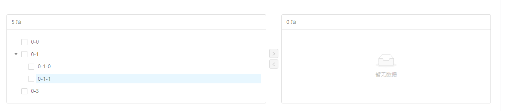
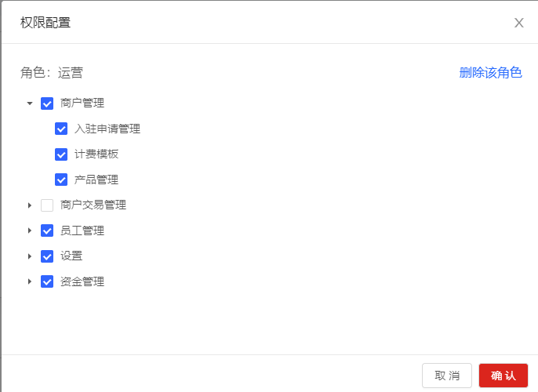
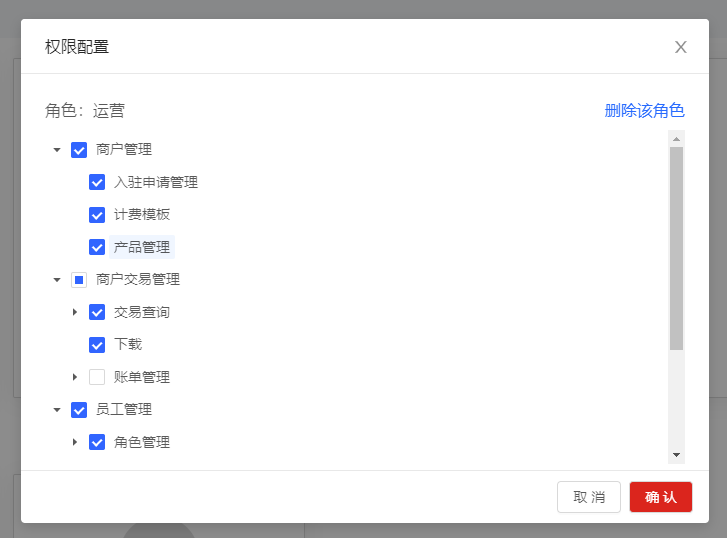

使用了两种方式实现权限管理的选择框（即菜单树形结构，选择当前角色的菜单和按钮权限）

使用穿梭框效果：
</br>
实现代码：

```vue
<template>
    <!-- 文件备份，穿梭框式的权限选择 -->
    <div>
        <a-modal
            v-model="visible"
            title="权限配置"
            width="688px"
            height="700px"
        >
            <!-- {{ treeData }} -->
            <div
                v-if="roleName.length > 0"
                style="height: 32px; font-size: 16px; display: flex; justify-content: space-between"
            >
                <div style="ling-height: 56px">角色：{{ roleName }}</div>
                <div
                    style="color: #276afe; float: right; cursor: pointer"
                    @click="deleteRole"
                    v-action:1004019901
                >
                    删除该角色
                </div>
            </div>
            <a-transfer
                class="tree-transfer"
                :data-source="transferDataSource"
                :target-keys="targetKeys"
                :render="(item) => item.title"
                :show-select-all="true"
                @change="onChange"
            >
                <template
                    slot="children"
                    slot-scope="{
                        props: { direction, selectedKeys },
                        on: { itemSelect },
                    }"
                >
                    <a-tree
                        v-if="direction === 'left'"
                        blockNode
                        checkable
                        defaultExpandAll
                        :checkedKeys="[...selectedKeys, ...targetKeys]"
                        :treeData="treeData"
                        @check="
                            (_, props) => {
                                onChecked(
                                    _,
                                    props,
                                    [...selectedKeys, ...targetKeys],
                                    itemSelect
                                )
                            }
                        "
                        @select="
                            (_, props) => {
                                onChecked(
                                    _,
                                    props,
                                    [...selectedKeys, ...targetKeys],
                                    itemSelect
                                )
                            }
                        "
                    />
                </template>
            </a-transfer>
            <template slot="footer">
                <a-button key="back" @click="handleCancel"> 取消 </a-button>
                <a-button
                    key="submit"
                    @click="handleOk"
                    style="background-color: #db251d; color: #fff"
                >
                    确认
                </a-button>
            </template>
        </a-modal>
    </div>
</template>
<script>
import { getInstitutionRightTree, deleteRole } from '@/api/staffManagement'
export default {
    data() {
        return {
            visible: false,
            targetKeys: [],
            // dataSource: transferDataSource,
            transferDataSource: [],
            // treeData: [],
            rightTreeData: [],
            roleName: '',
            roleID: '',
            selectedRowKeys: [], // 选中的行的key值
            selectedRows: [], // 选中行的row
            totalChecked: '',
        }
    },
    computed: {
        treeData() {
            return this.handleTreeData(this.rightTreeData, this.targetKeys)
        },
    },
    created() {},
    mounted() {
        // debugger
    },
    methods: {
        open(item) {
            this.visible = true
            const _this = this
            if (item) {
                this.roleName = item.roleName
                this.roleID = item.roleID
            }
            getInstitutionRightTree({}).then((res) => {
                if (res.code === '2000') {
                    // _this.rightTreeData = []
                    _this.rightTreeData = res.data.rightTree
                    console.log(_this.rightTreeData)
                    // _this.treeData = res.data.RightTree
                    this.flatten(JSON.parse(JSON.stringify(this.rightTreeData)))
                } else {
                    _this.$message.error(res.message)
                }
            })
        },
        deleteRole() {
            const that = this
            this.$confirm({
                title: `是否确定删除该角色信息？`,
                onOk() {
                    deleteRole({ roleID: that.roleID }).then((res) => {
                        if (res.code === '2000') {
                            that.$message.success(`删除成功`)
                            that.visible = false
                            // that.$route.go(-1)
                            that.$emit('refresh')
                        } else {
                            that.$message.success(`删除失败`)
                        }
                    })
                },
                onCancel() {},
            })
        },
        handleOk() {
            if (this.roleID) {
                this.$emit('setRights', this.targetKeys, this.roleID)
            } else {
                this.$emit('setRights', this.targetKeys)
            }
            this.visible = false
        },
        handleCancel() {
            this.visible = false
        },
        onChange(targetKeys, direction) {
            // console.log('Target Keys:', targetKeys)
            // this.targetKeys = targetKeys
            this.targetKeys = targetKeys // 如果仅仅这样写是穿梭不到右边的，所以
            if (direction === 'right') {
                this.targetKeys = this.totalChecked
                // 如果你还要有其他需求，在里面可以再判断
            }
            // 但是，想要穿梭到左边来，得这样写
            if (direction === 'left') {
                this.targetKeys = targetKeys
            }
        },
        onChecked(_, e, checkedKeys, itemSelect) {
            // _这个下划线，就是你勾的key值，全选时，它就是所有的key值
            this.totalChecked = _ // 所以初始化一个状态赋
            const { eventKey } = e.node
            itemSelect(eventKey, !this.isChecked(checkedKeys, eventKey))
        },
        isChecked(selectedKeys, eventKey) {
            return selectedKeys.indexOf(eventKey) !== -1
        },
        handleTreeData(data, targetKeys = []) {
            data.forEach((item) => {
                item['disabled'] = targetKeys.includes(item.key)
                if (item.children) {
                    this.handleTreeData(item.children, targetKeys)
                }
            })
            return data
        },
        flatten(list) {
            if (list) {
                list.forEach((item) => {
                    this.transferDataSource.push(item)
                    this.flatten(item.children)
                })
            }
            // console.log(this.transferDataSource)
        },
    },
}
</script>
<style lang="less" scoped>
::v-deep .ant-modal-content {
    height: 504px;
    .ant-modal-body {
        height: 396px;
        .ant-transfer {
            height: 100%;
            .ant-transfer-list {
                width: 50%;
                overflow: auto;
            }
        }
    }
}
</style>
```

> 使用树形结构实现：
> 样子：

</br>


实现代码：

```vue
<template>
    <div>
        <a-modal
            v-model="visible"
            title="权限配置"
            width="688px"
            height="700px"
        >
            <!-- {{ treeData }} -->
            <div
                v-if="roleName.length > 0"
                style="height: 32px; font-size: 16px; display: flex; justify-content: space-between"
            >
                <div style="ling-height: 56px">角色：{{ roleName }}</div>
                <div
                    style="color: #276afe; float: right; cursor: pointer"
                    @click="deleteRole"
                    v-action:1004019901
                >
                    删除该角色
                </div>
            </div>
            <a-tree
                v-model="checkedKeys"
                checkable
                :expanded-keys="expandedKeys"
                :auto-expand-parent="autoExpandParent"
                :selected-keys="selectedKeys"
                :tree-data="rightTreeData"
                @expand="onExpand"
                @select="onSelect"
                @check="onCheck"
                style="overflow: auto; height: 96%"
            />
            <template slot="footer">
                <a-button key="back" @click="handleCancel"> 取消 </a-button>
                <a-button
                    key="submit"
                    @click="handleOk"
                    style="background-color: #db251d; color: #fff"
                >
                    确认
                </a-button>
            </template>
        </a-modal>
    </div>
</template>
<script>
import { getInstitutionRightTree, deleteRole } from '@/api/staffManagement'
export default {
    data() {
        return {
            visible: false,
            targetKeys: [],
            // dataSource: transferDataSource,
            transferDataSource: [],
            // treeData: [],
            rightTreeData: [],
            roleName: '',
            roleID: '',
            selectedRowKeys: [], // 选中的行的key值
            selectedRows: [], // 选中行的row
            totalChecked: '',

            expandedKeys: [],
            autoExpandParent: true,
            checkedKeys: [],
            checkedKeys1: [],
            selectedKeys: [],
        }
    },
    created() {},
    mounted() {
        // debugger
    },
    methods: {
        open(item, rightList) {
            this.visible = true
            const _this = this
            if (item) {
                this.roleName = item.roleName
                this.roleID = item.roleID
            }

            getInstitutionRightTree({}).then((res) => {
                if (res.code === '2000') {
                    _this.rightTreeData = res.data.rightTree
                    if (rightList) {
                        this.checkedKeys = rightList
                    }
                    console.log(rightList)
                } else {
                    _this.$message.error(res.message)
                }
            })
        },
        deleteRole() {
            const that = this
            this.$confirm({
                title: `是否确定删除该角色信息？`,
                onOk() {
                    deleteRole({ roleID: that.roleID }).then((res) => {
                        if (res.code === '2000') {
                            that.$message.success(`删除成功`)
                            that.visible = false
                            // that.$route.go(-1)
                            that.$emit('refresh')
                        } else {
                            that.$message.error(`删除失败`)
                        }
                    })
                },
                onCancel() {},
            })
        },
        onExpand(expandedKeys) {
            console.log('onExpand', expandedKeys)
            // if not set autoExpandParent to false, if children expanded, parent can not collapse.
            // or, you can remove all expanded children keys.
            this.expandedKeys = expandedKeys
            this.autoExpandParent = false
        },
        onCheck(checkedKeys, e) {
            this.checkedKeys = checkedKeys
            this.checkedKeys1 = checkedKeys.concat(e.halfCheckedKeys)
            // console.log(this.checkedKeys, 'this.checkedKeys')
            // console.log(this.checkedKeys1, 'this.checkedKeys1')
        },
        onSelect(selectedKeys, info) {
            console.log('onSelect', selectedKeys)
            console.log('onSelectinfo', info)
            this.selectedKeys = selectedKeys
        },
        handleOk() {
            if (this.roleID) {
                this.$emit('setRights', this.checkedKeys1, this.roleID)
                this.checkedKeys = []
            } else {
                this.$emit('setRights', this.checkedKeys1)
                this.checkedKeys = []
            }
            this.visible = false
        },
        handleCancel() {
            this.visible = false
        },
    },
}
</script>
<style lang="less" scoped>
::v-deep .ant-modal-content {
    height: 504px;
    .ant-modal-body {
        height: 396px;
        .ant-transfer {
            height: 100%;
            .ant-transfer-list {
                width: 50%;
                overflow: auto;
            }
        }
    }
}
</style>
```
