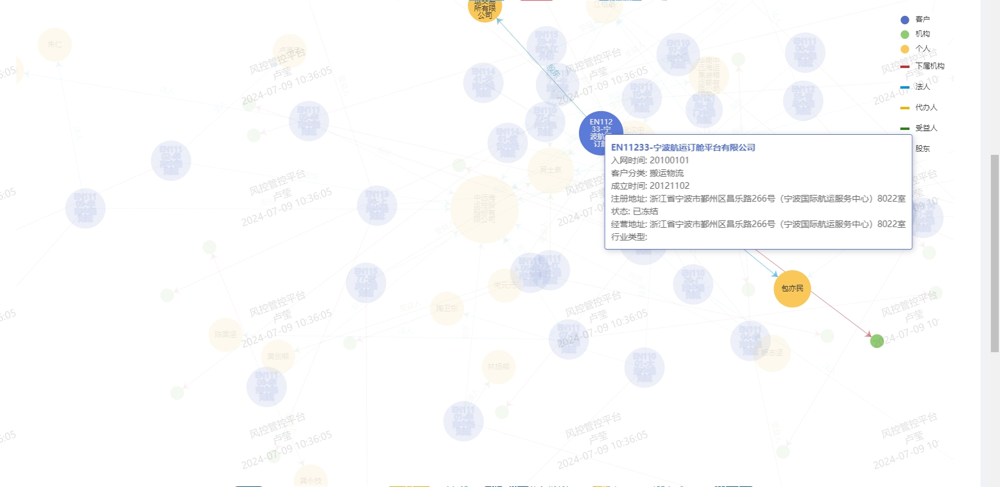
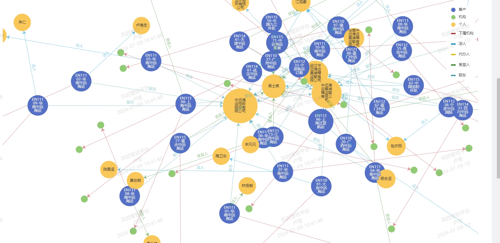
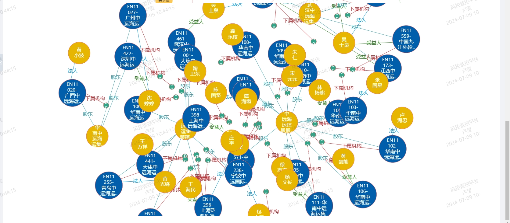
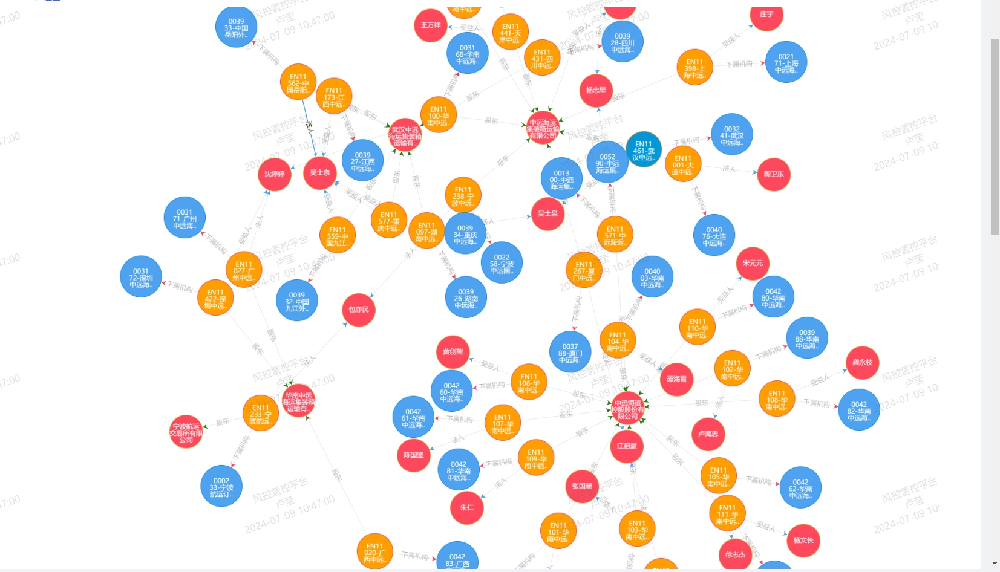

版本：

```js
"vue": "^2.6.10",
```

数据结构：

```js
graph:{
  categories:{
    name: "客户",
    symbol: "circle"
  },
  links:{
    category: "股东",
    source: "EN10234",
    target: "zNReWB4HCrpC31F8DnSnxA==",
  },
  nodes:{
    category: "客户",
    id: "EN10205",
    name: "EN10205-抚州市恩牛网络小额贷款有限公司",
    value:{
      入网时间: "20180129",
      客户分类: "准金融机构",
      成立时间: "20170623",
      注册地址: "江西省抚州市抚州高新技术产业开发区科创孵化基地中小企业创业园A7栋二楼",
      状态: "已冻结".
      经营地址: "江西省抚州市抚州高新技术产业开发区科创孵化基地中小企业创业园A7栋二楼",
      行业类型: "金融业"
    }
  }
}
```

## 1、方式一：echarts graph 实现

```js
"echarts": "^5.4.2",
```

参考文档：https://echarts.apache.org/zh/option.html#series-graph.type
实现效果：



代码：

```vue
<template>
  <div ref="chartRef" class="my-chart"></div>
</template>

<script>
import * as echarts from "echarts/core";
import { TooltipComponent, LegendComponent } from "echarts/components";
import { GraphChart } from "echarts/charts";
import { LabelLayout } from "echarts/features";
import { CanvasRenderer } from "echarts/renderers";

echarts.use([
  TooltipComponent,
  LegendComponent,
  GraphChart,
  CanvasRenderer,
  LabelLayout,
]);

export default {
  name: "GraphChart",
  props: {
    graph: {
      type: Object,
      default: () => {},
    },
    type: {
      type: String,
      default: "",
    },
  },
  data() {
    return {
      chart: null,
    };
  },
  watch: {
    graph: {
      handler(val) {
        if (val && Object.keys(val).length) {
          this.setChart();
        }
      },
      deep: true,
      // immediate: true
    },
  },
  mounted() {
    this.setChart();
  },
  methods: {
    resize() {
      this.chart.resize();
    },
    initChart() {
      const chartRef = this.$refs.chartRef;
      this.chart = echarts.init(chartRef);
    },
    setChart() {
      console.log("setchart");
      if (this.chart) this.chart.dispose();
      this.initChart();
      if (!this.graph || !Object.keys(this.graph).length) return;
      console.log(111);
      // 节点大于50个 密集配置
      const denseModel = this.graph.nodes.length > 40;
      const colorArr = [
        "#c12e34",
        "#0098d9",
        "#e6b600",
        "#2b821d",
        "#339ca8",
        "#32a487",
        "#005eaa",
        "#cda819",
      ];
      let colorIndex = 0;

      const LINK_MAP = {};

      const data = this.graph.categories.map((item) => {
        if (item.symbol === "rect") {
          const color = colorArr[colorIndex++];
          LINK_MAP[item.name] = color;
          return {
            name: item.name,
            itemStyle: {
              color,
              borderColor: "#fff",
              borderWidth: 10,
            },
          };
        } else {
          return { name: item.name, icon: "circle" };
        }
      });

      // 增加当前节点图例
      const categories = JSON.parse(JSON.stringify(this.graph.categories));
      if (this.type === "query") {
        categories.push({ name: "当前节点", symbol: "circle" });
        data.unshift({
          name: "当前节点",
          icon: "circle",
          itemStyle: { color: "#ee6666" },
        });
      }

      const NODE_MAP = {};
      let max = 0;

      const links = this.graph.links.map((item) => {
        if (NODE_MAP[item.source]) {
          NODE_MAP[item.source]++;
          max = NODE_MAP[item.source] > max ? NODE_MAP[item.source] : max;
        } else NODE_MAP[item.source] = 1;

        if (NODE_MAP[item.target]) {
          NODE_MAP[item.target]++;
          max = NODE_MAP[item.target] > max ? NODE_MAP[item.target] : max;
        } else NODE_MAP[item.target] = 1;

        const color = LINK_MAP[item.category];
        return {
          ...item,
          lineStyle: { color },
          // ignoreForceLayout: false,
          label: {
            color,
            show: !denseModel || item.category !== "下属机构",
            formatter: (params) => {
              return params.data.category || "";
            },
          },
        };
      });

      const nodes = this.graph.nodes.map((item) => {
        const symbolSize = ((NODE_MAP[item.id] - 1) / (max - 1)) * 50 + 50;
        const nameArr = item.name.split("-");
        const flag = item.value && item.value.flag;
        let name = nameArr[0];

        if (nameArr.length > 1) name += "-" + nameArr[1].slice(0, 6);
        return {
          ...item,
          x: flag && 600,
          y: flag && 400,
          fixed: flag,
          name,
          originName: item.name,
          symbolSize: flag
            ? 120
            : denseModel && item.category === "机构"
            ? 20
            : symbolSize,
          itemStyle: flag && {
            borderColor: "#fff",
            borderWidth: 3,
            shadowBlur: 10,
            // shadowColor: 'rgba(0, 0, 0, 0.6)',
            shadowColor: "#ee6666",
            color: "#ee6666",
          },
          label: {
            show: flag ? true : !denseModel || item.category !== "机构",
          },
        };
      });

      const option = {
        legend: {
          data,
          orient: "vertical",
          right: 10,
          top: 20,
          backgroundColor: "#fff",
          inactiveBorderColor: "#fff",
          inactiveBorderWidth: 10,
        },
        tooltip: {
          formatter: (params) => {
            if (!params.value) return false;
            let str = `<div style="color: ${params.color};font-weight: bold">${params.data.originName}</div>`;
            Object.keys(params.value).forEach((key) => {
              let value = params.value[key];
              if (key === "证件号码")
                value = value.slice(0, 3) + "***********" + value.slice(-4);
              if (key !== "flag") str += `<div>${key}: ${value}</div>`;
            });
            return str;
          },
        },
        series: [
          {
            type: "graph",
            layout: "force",
            symbolSize: 50,
            animation: false,
            draggable: true, // 节点是否可拖拽
            autoCurveness: true,
            focusNodeAdjacency: true,
            edgeSymbol: ["", "arrow"],
            data: nodes,
            categories,
            roam: true, // 鼠标平移漫游
            force: {
              repulsion: denseModel ? 800 : 300, // 节点之间的斥力因子。支持数组表达斥力范围，值越大斥力越大。
              gravity: 0.01, // 节点受到的向中心的引力因子。该值越大节点越往中心点靠拢。
              edgeLength: denseModel ? [30, 80] : 40, // 边的两个节点之间的距离，这个距离也会受 repulsion影响 。值越大则长度越长
              layoutAnimation: true, // 因为力引导布局会在多次迭代后才会稳定，这个参数决定是否显示布局的迭代动画，在浏览器端节点数据较多（>100）的时候不建议关闭，布局过程会造成浏览器假死
              friction: 0.02,
            },
            edges: links,
            label: {
              overflow: "break",
              width: 40,
            },
          },
        ],
      };
      this.chart && this.chart.setOption(option);
      this.chart.on("legendselectchanged", (params) => {
        const selectedArr = [];
        Object.keys(params.selected).forEach((key) => {
          if (params.selected[key]) selectedArr.push(key);
        });
        const newLinks = links.filter((item) =>
          selectedArr.includes(item.category)
        );
        option.series[0].edges = newLinks;
        option.legend.selected = params.selected;

        this.chart.setOption(option, true);
      });
    },
  },
};
</script>

<style scoped lang="less">
.my-chart {
  width: 100%;
  height: 800px;
  font-weight: bold;
}
</style>
```

## 2、antg6 forceAtlas2 实现

```js
@antv/g6": "4.1.11",
```

参考文档：https://g6.antv.antgroup.com/examples/net/forceDirected/#basicFA2
参考代码地址：https://gitee.com/devilly/antg6-Force-Atlas-2
实现效果：

代码：

```vue
<template>
  <div>
    <div class="g6-x" id="containerG6" ref="containerG6"></div>
  </div>
</template>
<script>
import G6 from "@antv/g6";
import { debounce } from "@/utils/helper/commonUtil";
export default {
  props: {
    graph: {
      type: Object,
      default: () => {},
    },
    type: {
      type: String,
      default: "",
    },
  },
  data() {
    return {
      g6Graph: null,
      globalStyle: {
        normalLineWidth: 1, // 默认的时候lineWidth大小
        hoverLineWidth: 6, // hover时的lineWidth大小
        nodeSize: 120, // 初始节点大小
        fontSize: 18, // 文字尺寸
        fontMaxRows: 4, // 限制最多多少行
      },
      toolbar: null,
      $_resizeCanvas: null,
    };
  },
  mounted() {
    this.init();
    // 节流检测全屏状态更新画布位置和大小
    // this.$_resizeCanvas = debounce(() => {
    //     this.resizeCanvas()
    //   }, 10, true)
    //   window.addEventListener('resize', this.$_resizeCanvas)
  },
  beforeDestroy() {
    // window.removeEventListener('resize', this.$_resizeCanvas) // 移除事件
    // this.$_resizeCanvas = null
  },
  Destroy() {
    // window.removeEventListener('resize', this.$_resizeCanvas) // 移除事件
    // this.$_resizeCanvas = null
  },
  methods: {
    init() {
      const COLORMAP = {};
      const NODESIZEMAP = {
        客户: 100,
        机构: 20,
        个人: 80,
      };
      const colorArr = [
        "#005eaa",
        "#32a487",
        "#e6b600",
        "#c12e34",
        "#0098d9",
        "#cda819",
        "#2b821d",
        "#339ca8",
      ];
      this.graph.categories.map((item, index) => {
        COLORMAP[item.name] = colorArr[index];
      });
      console.log(COLORMAP, "COLORMAP");

      const g6_nodes = this.graph.nodes.map((item) => {
        const { category, id, name, value } = item;
        const flag = value && value.flag; // flag为1，说明这是查询的目标节点
        const vNode = {
          name, // 备份原始数据名
          id,
          label: name, // 处理后的字符串
          // class_type: type, // type与原始配置属性type冲突 所以起名为class_type
          size: flag ? 120 : NODESIZEMAP[category], // 优先取目标节点为最大的， 没有则默认size
          style: {
            fill: COLORMAP[category],
          },
          // 配置文本
          labelCfg: {
            style: {
              fontSize: this.globalStyle.fontSize,
              fill: "white", // 文字颜色
              cursor: "pointer", // 鼠标悬浮时的鼠标样式
            },
            position: "center", // label所在位置
          },
        };
        vNode.label = this.fittingString(
          vNode,
          this.globalStyle.fontSize,
          this.globalStyle.fontMaxRows
        );
        return vNode;
      });
      const g6_edges = this.graph.links.map((item) => {
        const { category, source, target } = item;
        return {
          category, // 备份原始数据名
          label: category,
          source,
          target,
          path: {
            endArrow: true,
          },
          // class_type: type,
          style: {
            lineWidth: this.globalStyle.normalLineWidth, // 边线宽度
            stroke: COLORMAP[category], // 线条颜色
            cursor: "pointer", // 鼠标悬浮时的鼠标样式
            lineDash: [0], // 虚线  [0] 实线
            // lineDash: [0]//[0] 实线
          },
          // 配置文本
          labelCfg: {
            style: {
              fontSize: this.globalStyle.fontSize,
              fill: COLORMAP[category], // 文字颜色
            },
          },
        };
      });
      const data = {
        nodes: g6_nodes,
        edges: g6_edges,
      };
      // 处理两个节点多条边 两条平行边的之间的距离改为50
      G6.Util.processParallelEdges(data.edges, 50);
      const containerG6 = this.$refs.containerG6;
      const width = containerG6.scrollWidth || 1000;
      const height = containerG6.scrollHeight || 500;
      this.g6Graph = new G6.Graph({
        container: containerG6,
        width,
        height,
        fitView: false, // 是否开启画布自适应。开启后图自动适配画布大小。
        fitCenter: true, // 开启后，图将会被平移，图的中心将对齐到画布中心，但不缩放。优先级低于 fitView
        autoPaint: true, // 当图中元素更新，或视口变换时，是否自动重绘。建议在批量操作节点时关闭，以提高性能，完成批量操作后再打开，参见后面的 setAutoPaint() 方法
        modes: {
          default: ["zoom-canvas", "drag-canvas", "drag-node"],
        },
        layout: {
          type: "forceAtlas2",
          kr: 10,
          center: [250, 250],
          // focusNode: this.focusNode,
          preventOverlap: true, // 是否防止重叠，必须配合下面属性 nodeSize 或节点数据中的 size 属性，只有在数据中设置了 size 或在该布局中配置了与当前图节点大小相同的 nodeSize 值，才能够进行节点重叠的碰撞检测
          strictRadial: true,
          nodeSize: this.globalStyle.nodeSize,
          // linkDistance: 150, // 每个线条长度
          nodeSpacing: 300, // 防止重叠时节点边缘间距的最小值可计算
          maxPreventOverlapIteration: 7000, // 防止重叠步骤的最大迭代次数
          unitRadius: 300, // 每一圈距离上一圈的距离。默认填充整个画布，即根据图的大小决定
        },
        defaultNode: {
          // 默认状态下节点的配置
          size: 20,
          borderColor: "#fff",
          borderWidth: 1,
          shadowBlur: 10,
          // shadowColor: 'rgba(0, 0, 0, 0.6)',
          // shadowColor: '#ee6666',
          color: "#ee6666",
        },
        defaultEdge: {
          // 默认状态下边的配置
        },
      });
      this.g6Graph.data(data);
      this.g6Graph.render();
    },
    // 超出换行,溢出省略
    fittingString(node, fontSize, max_rows) {
      let currentWidth = 0; // 计算宽度
      let next_index = 0; // 下次截取坐标
      const result = []; // 结果
      let numberOfExecutions = 1; // 执行次数
      let str = node.label;
      // 根据节点size 减去 3个字符宽度 来确认最大宽
      const maxWidth = Math.floor(node.size - fontSize * 3);
      str = str.replace(/\s?/g, ""); // 所有空格去除
      const array_str = str.split("");
      const pattern = new RegExp("[\u4E00-\u9FA5]+"); // 汉字字符
      array_str.map((item, i) => {
        // 中文或英文的宽度占用计算方式
        if (pattern.test(item)) {
          currentWidth += fontSize;
        } else {
          currentWidth += G6.Util.getLetterWidth(item, fontSize);
        }
        if (max_rows >= numberOfExecutions) {
          if (currentWidth > maxWidth) {
            // 第一次执行时从下标0开始
            currentWidth = 0;
            result.push(str.slice(next_index, i));
            numberOfExecutions++;
            next_index = i; // 记录本次截取的截止下标作为下一次的开始下标
          }
          // 如果到最后一次执行  且执行次数大于1
          if (i === array_str.length - 1 && numberOfExecutions > 1) {
            const last_str = str.slice(next_index, array_str.length);
            result.push(last_str);
          }
        }
      });
      if (result.length < 1) {
        return str;
      } else {
        // 用于判断字符是否和初始的字符一样长度 如果不一样说明 还有剩余字符未展示 则用省略号替代...
        const str_array = result.join("");
        if (str_array.length !== str.length) {
          result[max_rows - 1] = result[max_rows - 1] + "..";
        }
        return result.join("\n");
      }
    },
    // 页面视口大小更新后canvas画布进行更新
    resizeCanvas() {
      const dom = document.getElementById("containerG6");
      const { width, height } = dom.getBoundingClientRect();
      this.g6Graph.changeSize(width, height); // 改变画布大小 设置为最大视口宽高
      this.toolbar.handleDefaultOperator("autoZoom");
    },
    nodeSpacingComputed(d) {
      return d.size || this.globalStyle.nodeSize;
    },
  },
};
</script>
<style scoped lang="less">
#containerG6 {
  width: 100%;
  height: 700px;
  font-weight: bold;
}
</style>
```

## 3、d3+ cytoscape 实现(仿企查查)

```js
"cytoscape": "3.20.0",
"d3": "5.16.0",
```

参考文档：
参考代码地址：https://gitee.com/devilly/d3
实现效果：

代码：

```vue
<template>
  <div style="width: 100%;height: calc(100vh - 40px);">
    <div
      id="d3Container"
      ref="d3Container"
      style="width:100%;height:100%;"
    ></div>
  </div>
</template>
<script>
import * as d3 from "d3";
import cytoscape from "cytoscape";
import $ from "jquery";
export default {
  props: {
    graph: {
      type: Object,
      default: () => {},
    },
    type: {
      type: String,
      default: "",
    },
  },
  data() {
    return {
      D3Graph: null,
      rootNode: null,
      currentKeyNo: null,
      COLOR: {
        node: {
          客户: "#ff9e00",
          机构: "#4ea2f0",
          个人: "#FD485E",
          current: "#0098d9",
        },
        border: {
          客户: "#FD485E",
          机构: "#128BED",
          个人: "#EF941B",
          current: "#EF941B",
        },
        line: {
          下属机构: "#fd485e",
          法人: "#4ea2f0",
          代办人: "#4ea2f0",
          受益人: "#4ea2f0",
          股东: "#2b821d",
          default: "#4ea2f0",
        },
      },
      maxChildrenLength: 0,
      isNeedReload: false,
      isGraphLoaded: false,
      Circle_Radius: { 客户: 65, 机构: 75, 个人: 60 },
      hidden: "",
      state: "",
      visibilityChange: "",
      isFocus: false,
      activeNode: "",
      graphData: {},
      layoutNode: null,
    };
  },
  mounted() {
    const that = this;
    this.init();
    this.graphData = this.initData();
    this.getD3Position(this.graphData);
    setTimeout(function () {
      that.drawGraph(that.transformData(that.graphData));
    }, 500);
  },
  methods: {
    init() {
      /** 网页当前状态判断 (解决没布局完就切换页面造成点聚集在一起) */
      if (typeof document.hidden !== "undefined") {
        this.hidden = "hidden";
        this.visibilityChange = "visibilitychange";
        this.state = "visibilityState";
      } else if (typeof document.mozHidden !== "undefined") {
        this.hidden = "mozHidden";
        this.visibilityChange = "mozvisibilitychange";
        this.state = "mozVisibilityState";
      } else if (typeof document.msHidden !== "undefined") {
        this.hidden = "msHidden";
        this.visibilityChange = "msvisibilitychange";
        this.state = "msVisibilityState";
      } else if (typeof document.webkitHidden !== "undefined") {
        this.hidden = "webkitHidden";
        this.visibilityChange = "webkitvisibilitychange";
        this.state = "webkitVisibilityState";
      }
    },
    initData() {
      var graph = {};
      graph.nodes = [];
      graph.links = [];
      graph.nodes = this.graph.nodes.map((item, index) => {
        const { category, id, name, value } = item;
        const flag = (value && value.flag) || index === 0; // flag为1，说明这是查询的目标节点

        const o = {};
        o.flag = flag;
        o.nodeId = id;
        o.keyNo = Math.random();
        o.category = category;
        o.data = {};
        o.name = name;
        o.data.obj = item;
        o.data.showStatus = null; // NORMAL HIGHLIGHT DULL
        o.layout = {};
        o.layout.level = null; // 1 当前查询节点
        o.layout.singleLinkChildren = []; // 只连接自己的node
        if (flag) {
          this.rootNode = o;
          this.currentKeyNo = id;
        }
        return o;
      });
      graph.links = this.graph.links.map((item) => {
        const { category, source, target } = item;
        const o = {};
        o.data = {};
        o.data.obj = item;
        o.category = category;
        o.data.showStatus = null;
        o.data.showStatus = null; // NORMAL HIGHLIGHT DULL
        o.sourceNode = this.getGraphNode(source, graph.nodes);
        o.targetNode = this.getGraphNode(target, graph.nodes);
        o.linkId = Math.random();
        o.source = this.getNodesIndex(source, graph.nodes);
        o.target = this.getNodesIndex(target, graph.nodes);
        return o;
      });
      this.setLevel(graph.nodes, graph.links);
      this.setCategoryColor(graph.nodes, graph.links);

      return graph;
    },
    getD3Position(graph) {
      const that = this;
      this.getLayoutNode(graph);

      function filterLinks1(graph) {
        // 筛选用于布局的links
        var layoutLinks = [];
        for (var i = 0; i < graph.links.length; i++) {
          var link = graph.links[i];
          // console.log(link);
          var sourceLevel = link.sourceNode.layout.level;
          var targetLevel = link.targetNode.layout.level;
          // console.log('sourceLevel：' + sourceLevel + ', targetLevel：' + targetLevel);
          var sourceNode = link.sourceNode;
          var targetNode = link.targetNode;
          //            sourceNode.layout.isSetLink = false;
          //            targetNode.layout.isSetLink = false;

          //            if(!sourceNode.layout.isSetLink && !targetNode.layout.isSetLink){
          if (
            (sourceLevel === 1 && targetLevel === 2) ||
            (sourceLevel === 2 && targetLevel === 1)
          ) {
            //                    sourceNode.layout.isSetLink = true;
            //                    targetNode.layout.isSetLink = true;
            layoutLinks.push(link);
          }
          if (
            (sourceLevel === 2 && targetLevel === 3) ||
            (sourceLevel === 3 && targetLevel === 2)
          ) {
            //                    sourceNode.layout.isSetLink = true;
            //                    targetNode.layout.isSetLink = true;
            layoutLinks.push(link);
          }
        }

        layoutLinks.forEach(function (link, i) {
          if (link.targetNode.layout.level === 3) {
            layoutLinks.forEach(function (alink, j) {
              if (
                alink.linkId !== link.linkId &&
                (alink.targetNode.nodeId === link.targetNode.nodeId ||
                  alink.sourceNode.nodeId === link.targetNode.nodeId)
              ) {
                layoutLinks.splice(j, 1);
              }
            });
          }

          if (link.sourceNode.layout.level === 3) {
            layoutLinks.forEach(function (alink, j) {
              if (
                alink.linkId !== link.linkId &&
                (alink.targetNode.nodeId === link.sourceNode.nodeId ||
                  alink.sourceNode.nodeId === link.sourceNode.nodeId)
              ) {
                layoutLinks.splice(j, 1);
              }
            });
          }
        });

        return layoutLinks;
      }

      function filterLinks2(graph) {
        // 筛选用于布局的links
        var layoutLinks = [];
        for (var i = 0; i < graph.links.length; i++) {
          var link = graph.links[i];
          var sourceLevel = link.sourceNode.layout.level;
          var targetLevel = link.targetNode.layout.level;
          var sourceNode = link.sourceNode;
          var targetNode = link.targetNode;

          if (
            (sourceLevel === 1 && targetLevel === 2) ||
            (sourceLevel === 2 && targetLevel === 1)
          ) {
            layoutLinks.push(link);
          }
          if (
            (sourceLevel === 2 && targetLevel === 3) ||
            (sourceLevel === 3 && targetLevel === 2)
          ) {
            layoutLinks.push(link);
          }
        }

        return layoutLinks;
      }

      function initD3Data(graph) {
        //
        function getIndex(val, arr) {
          var index = 0;
          for (var i = 0; i < arr.length; i++) {
            var obj = arr[i];
            if (val === obj.nodeId) {
              index = i;
              break;
            }
          }
          return index;
        }

        /* 封装符合d3的数据 */
        for (var i = 0; i < graph.nodes.length; i++) {
          var node = graph.nodes[i];
          node.id = node.nodeId;
        }

        for (var j = 0; j < graph.links.length; j++) {
          var link = graph.links[j];
          link.source = getIndex(link.sourceNode.nodeId, graph.nodes);
          link.target = getIndex(link.targetNode.nodeId, graph.nodes);
          link.index = i; //
        }

        graph.layoutLinks = filterLinks1(graph);

        // 围绕节点最大数值
        that.setSingleLinkNodes(graph.layoutLinks);
        graph.nodes.forEach(function (node, i) {
          if (
            node.layout.singleLinkChildren.length &&
            that.maxChildrenLength < node.layout.singleLinkChildren.length
          ) {
            that.maxChildrenLength = node.layout.singleLinkChildren.length;
          }
        });
        // _maxChildrenLength = 60;
        console.log("围绕节点最大数值:" + that.maxChildrenLength);
      }

      initD3Data(graph); //

      //    var width = $("#MainD3 svg").width();
      // width = $(window).width();
      // console.log(width);
      //    var height = $("#MainD3 svg").height();
      // height = $(window).height();
      // console.log(height);

      var strength = -600;
      var distanceMax = 330;
      var theta = 0;
      var distance = 130;
      var colideRadius = 35;
      var distanceMin = 400;
      // 根据节点数量调节
      if (graph.nodes.length < 50) {
        strength = -800;
        distanceMax = 400;
      } else if (graph.nodes.length > 50 && graph.nodes.length < 100) {
        strength = -800;
        distanceMax = 350;
        distance = 130;
        colideRadius = 35;
      } else if (graph.nodes.length > 100 && graph.nodes.length < 150) {
        strength = -900;
        distanceMax = 450;
      } else if (graph.nodes.length > 150 && graph.nodes.length < 200) {
        strength = -1000;
        distanceMax = 500;
      } else if (graph.nodes.length > 200) {
        strength = -1600;
        distanceMax = 500;
        theta = 0.6;
        distance = 100;
        colideRadius = 35;
      }

      // 根据围绕数量调节
      if (this.maxChildrenLength > 50 && this.maxChildrenLength < 100) {
        strength = -2000;
        distanceMax = 500;
      } else if (
        this.maxChildrenLength > 1000 &&
        this.maxChildrenLength < 2000
      ) {
        strength = -4000;
        distanceMax = 1500;
      }

      d3.forceSimulation(graph.nodes)
        .force(
          "charge",
          d3
            .forceManyBody()
            .strength(strength)
            .distanceMax(distanceMax)
            .theta(theta)
        )
        .force("link", d3.forceLink(graph.links).distance(distance))
        .force("center", d3.forceCenter())
        .force(
          "collide",
          d3.forceCollide().radius(function () {
            return colideRadius;
          })
        );
      // .force('forceY', d3.forceY().strength(0.04))
    },
    drawGraph(elements) {
      const that = this;
      // _currentKeyNo,
      //   (_companyRadius = 35),
      //   (_personRadius = 15),
      //   (_circleMargin = 10),
      //   (_circleBorder = 3);
      this.cy = cytoscape({
        container: document.getElementById("d3Container"),
        motionBlur: false,
        textureOnViewport: false,
        wheelSensitivity: 0.1,
        elements: elements,
        minZoom: 0.4,
        maxZoom: 2.5,
        layout: {
          name: "preset",
          componentSpacing: 40,
          nestingFactor: 12,
          padding: 10,
          edgeElasticity: 800,
          stop: function (e) {
            // 解决浏览器标签切换排列问题
            if (document[this.state] === "hidden") {
              this.isNeedReload = true;
              //                        console.log('stop _isNeedReload=true');
            } else {
              this.isNeedReload = false;
            }
            setTimeout(function () {
              if (document[this.state] === "hidden") {
                this.isGraphLoaded = false;
                console.log("stop _isGraphLoaded=false");
              } else {
                this.isGraphLoaded = true;
              }
            }, 1000);
          },
        },
        style: [
          {
            selector: "node",
            style: {
              shape: "ellipse",
              width: function (ele) {
                const category = ele.data("category").toLowerCase();
                return that.Circle_Radius[category]
                  ? that.Circle_Radius[category]
                  : that.Circle_Radius["个人"];
              },
              height: function (ele) {
                const category = ele.data("category").toLowerCase();
                return that.Circle_Radius[category]
                  ? that.Circle_Radius[category]
                  : that.Circle_Radius["个人"];
              },
              "background-color": function (ele) {
                // debugger
                return ele.data("color");
              },
              "background-fit": "cover",
              "background-image": function (ele) {
                // var hasImage = ele.data("hasImage");
                // var keyNo = ele.data("keyNo");
                // var type = ele.data("type");
                // if (hasImage && type == "Person") {
                //   return keyNo;
                // } else {
                //   return "none";
                // }
              },
              // 'background-image-crossorigin': 'use-credentials',
              "border-color": function (ele) {
                return ele.data("borderColor");
              },
              "border-width": function (ele) {
                if (ele.data("hasImage") && ele.data("type") === "个人") {
                  return 3;
                } else {
                  return 1;
                }
              },
              "border-opacity": 1,
              label: function (ele) {
                var label = ele.data("name");
                var length = label.length;
                if (length <= 5) {
                  // 4 5 4排列
                  return label;
                } else if (length >= 5 && length <= 9) {
                  return (
                    label.substring(0, length - 5) +
                    "\n" +
                    label.substring(length - 5, length)
                  );
                } else if (length >= 9 && length <= 13) {
                  return (
                    label.substring(0, 4) +
                    "\n" +
                    label.substring(4, 9) +
                    "\n" +
                    label.substring(9, 13)
                  );
                } else {
                  return (
                    label.substring(0, 4) +
                    "\n" +
                    label.substring(4, 9) +
                    "\n" +
                    label.substring(9, 12) +
                    ".."
                  );
                }
              },
              "z-index-compare": "manual",
              "z-index": 20,
              color: "#fff",
              // 'padding-top':0,
              padding: function (ele) {
                // if(ele.data("type") == 'Company'){
                //     return 3;
                // }
                return 0;
              },
              "font-size": 12,
              // 'min-height':'400px',
              // 'ghost':'yes',
              // 'ghost-offset-x':300,
              // 'font-weight':800,
              // 'min-zoomed-font-size':6,
              "font-family": "microsoft yahei",
              "text-wrap": "wrap",
              "text-max-width": 60,
              "text-halign": "center",
              "text-valign": "center",
              "overlay-color": "#fff",
              "overlay-opacity": 0,
              "background-opacity": 1,
              "text-background-color": "#000",
              "text-background-shape": "roundrectangle",
              "text-background-opacity": function (ele) {
                return 0;
                // if(ele.data('hasImage') && ele.data('type') == 'Person'){
                //     return 0.3;
                // } else {
                //     return 0
                // }
              },
              "text-background-padding": 0,
              "text-margin-y": function (ele) {
                const length = ele.data("name").length;
                // 当前节点有图片
                return length < 5 ? 0 : 4;
              },
            },
          },
          {
            selector: "edge",
            style: {
              "line-style": function (ele) {
                return "solid";
                /* if(ele.data('data').obj.type == 'INVEST'){
                                return 'solid';
                            } else {
                                return 'dashed'
                            } */
              },
              "curve-style": "bezier",
              "control-point-step-size": 20,
              "target-arrow-shape": "triangle-backcurve",
              "target-arrow-color": function (ele) {
                return ele.data("color");
              },
              "arrow-scale": 1,
              "line-color": function (ele) {
                return "#b3b3b3";
                // return ele.data("color");
              },
              label: function (ele) {
                return ele.data("label");
              },
              "text-opacity": 0.3,
              "font-size": 12,
              "background-color": function (ele) {
                return "#b3b3b3";
              },
              width: 0.3,
              "overlay-color": "#fff",
              "overlay-opacity": 0,
              "font-family": "microsoft yahei",
            },
          },
          {
            selector: ".autorotate",
            style: {
              "edge-text-rotation": "autorotate",
            },
          },
          {
            selector: ".nodeActive",
            style: {
              // 'z-index':300,
              "border-color": function (ele) {
                return ele.data("color");
              },
              "border-width": 10,
              "border-opacity": 0.5,
            },
          },
          {
            selector: ".edgeShow",
            style: {
              color: "#999",
              "text-opacity": 1,
              "font-weight": 400,
              label: function (ele) {
                return ele.data("label");
              },
              "font-size": 10,
            },
          },
          {
            selector: ".edgeActive",
            style: {
              "arrow-scale": 0.8,
              width: 1.5,
              color: "#330",
              "text-opacity": 1,
              "font-size": 12,
              "text-background-color": "#fff",
              "text-background-opacity": 0.8,
              "text-background-padding": 0,
              "source-text-margin-y": 20,
              "target-text-margin-y": 20,
              // 'text-margin-y':3,
              "z-index-compare": "manual",
              "z-index": 1,
              "line-color": function (ele) {
                return ele.data("color");
              },
              "target-arrow-color": function (ele) {
                return ele.data("color");
              },
              label: function (ele) {
                /* if(ele.data('data').obj.type == 'INVEST'){
                                return 'solid';
                            } else {
                                return 'dashed'
                            } */
                return ele.data("label");
              },
            },
          },
          {
            selector: ".hidetext",
            style: {
              "text-opacity": 0,
            },
          },
          {
            selector: ".dull",
            style: {
              "z-index": 1,
              opacity: 0.2,
            },
          },
          {
            selector: ".nodeHover",
            style: {
              shape: "ellipse",
              "background-opacity": 0.9,
            },
          },
          {
            selector: ".edgeLevel1",
            style: {
              label: function (ele) {
                return ele.data("label");
              },
            },
          },
          {
            selector: ".edgeShowText",
            style: {
              label: function (ele) {
                return ele.data("label");
              },
            },
          },
          {
            selector: ".edgeHideText",
            style: {
              label: function (ele) {
                return "";
              },
            },
          },
          {
            selector: ".lineFixed", // 加载完成后，加载该类，修复线有锯齿的问题
            style: {
              "overlay-opacity": 0,
            },
          },
        ],
      });

      this.cy.on("click", "node", function (evt) {
        if (evt.target._private.style["z-index"].value === 20) {
          // 非暗淡状态
          this.isFocus = true;
          var node = evt.target;
          console.log(node);

          that.highLight([node._private.data.id], that.cy);

          if (node.hasClass("nodeActive")) {
            this.activeNode = null;
            // $('#company-detail').hide();
            node.removeClass("nodeActive");
            that.cy.collection("edge").removeClass("edgeActive");
          } else {
            var nodeData = node._private.data;
            if (nodeData.category === "机构") {
              // showDetail2(nodeData.keyNo,'company_muhou3');
              that.cy.collection("node").addClass("nodeDull");
            } else {
              // showDetail2(nodeData.keyNo,'company_muhou3','person');
              that.cy.collection("node").addClass("nodeDull");
            }

            this.activeNode = node;
            that.cy.collection("node").removeClass("nodeActive");

            that.cy.collection("edge").removeClass("edgeActive");
            node.addClass("nodeActive");
            node.neighborhood("edge").removeClass("opacity");
            node.neighborhood("edge").addClass("edgeActive");
            node.neighborhood("edge").connectedNodes().removeClass("opacity");
          }
          // _firstTab = false;
        } else {
          this.isFocus = false;
          this.activeNode = null;
          that.cy.collection("node").removeClass("nodeActive");
          // $('.tp-detail').fadeOut();
          that.cancelHighLight(that.cy);
        }
      });
      var showTipsTime = null;
      this.cy.on("mouseover", "node", function (evt) {
        if (evt.target._private.style["z-index"].value === 20) {
          // 非暗淡状态
          //
          $("#Main").css("cursor", "pointer");

          //
          var node = evt.target;
          node.addClass("nodeHover");
          if (!this.isFocus) {
            that.cy.collection("edge").removeClass("edgeShow");
            that.cy.collection("edge").removeClass("edgeActive");
            node.neighborhood("edge").addClass("edgeActive");
          }

          // 提示
          clearTimeout(showTipsTime);
          // if(node._private.data.name.length > 13 || (node._private.data.keyNo[0] == 'p' && node._private.data.name.length > 3) || node._private.data.layout.revel > 2){
          if (
            node._private.data.name.length > 13 ||
            (node._private.data.keyNo &&
              node._private.data.keyNo[0] === "p" &&
              node._private.data.name.length > 3)
          ) {
            showTipsTime = setTimeout(function () {
              var name = node._private.data.name;

              // 显示在节点位置
              /* var tipWidth = name.length * 12 + 16;
                        var x = node._private.data.d3x + 655 - (tipWidth / 2);
                        var y = node._private.data.d3y + 598;
                        if(node._private.data.type == 'Person'){
                            y = node._private.data.d3y + 590;
                        } */

              // 显示在鼠标位置
              var event = evt.originalEvent || window.event;
              var x = event.clientX + 10;
              var y = event.clientY + 10;

              var html =
                "<div class='tips' style='font-size:12px;background:white;box-shadow:0px 0px 3px #999;border-radius:1px;opacity:1;padding:1px;padding-left:8px;padding-right:8px;display:none;position: absolute;left:" +
                x +
                "px;top:" +
                y +
                "px;'>" +
                name +
                "</div>";
              $("body").append($(html));
              $(".tips").fadeIn();
            }, 600);
          }
        }
      });
      this.cy.on("mouseout", "node", function (evt) {
        $("#Main").css("cursor", "default");

        // 提示
        $(".tips").fadeOut(function () {
          $(".tips").remove();
        });

        clearTimeout(showTipsTime);

        //
        var node = evt.target;
        node.removeClass("nodeHover");
        if (!this.isFocus) {
          that.cy.collection("edge").removeClass("edgeActive");
          /* if(moveTimeer){
                    clearTimeout(moveTimeer);
                } */
          /* moveTimeer = setTimeout(function() {
                    this.cy.collection("edge").addClass("edgeActive");
                    //this.cy.collection("edge").addClass("edgeShow");
                }, 300);
                if(activeNode){
                    activeNode.neighborhood("edge").addClass("edgeActive");
                } */
        }
      });
      this.cy.on("mouseover", "edge", function (evt) {
        if (!this.isFocus) {
          var edge = evt.target;
          /* if(moveTimeer){
                    clearTimeout(moveTimeer);
                } */
          that.cy.collection("edge").removeClass("edgeActive");
          edge.addClass("edgeActive");
          /* if(activeNode){
                    activeNode.neighborhood("edge").addClass("edgeActive");
                } */
        }
      });
      this.cy.on("mouseout", "edge", function (evt) {
        if (!this.isFocus) {
          var edge = evt.target;
          edge.removeClass("edgeActive");
          // moveTimeer = setTimeout(function() {
          //     this.cy.collection("edge").addClass("edgeActive");
          //     //this.cy.collection("edge").addClass("edgeShow");
          // }, 400);
          if (this.activeNode) {
            this.activeNode.neighborhood("edge").addClass("edgeActive");
          }
        }
      });
      this.cy.on("vmousedown", "node", function (evt) {
        var node = evt.target;
        if (!this.isFocus) {
          that.highLight([node._private.data.id], that.cy);
        }
      });
      this.cy.on("tapend", "node", function (evt) {
        if (!this.isFocus) {
          that.cancelHighLight(that.cy);
        }
      });

      this.cy.on("click", "edge", function (evt) {
        console.log("click edge");
        this.isFocus = false;
        this.activeNode = null;
        that.cy.collection("node").removeClass("nodeActive");
        $(".tp-detail").fadeOut();
        that.cancelHighLight(that.cy);
      });
      this.cy.on("click", function (event) {
        var evtTarget = event.target;

        if (evtTarget === this.cy) {
          this.isFocus = false;
          this.activeNode = null;
          that.cy.collection("node").removeClass("nodeActive");
          $(".tp-detail").fadeOut();
          this.cancelHighLight(that.cy);
          this.focusCancel();
          this.filterReset();

          // this.cy.collection("edge").addClass("edgeActive");
        } else {
          // console.log('tap on some element');
        }
      });

      this.cy.on("zoom", function () {
        if (that.cy.zoom() < 0.5) {
          that.cy.collection("node").addClass("hidetext");
          that.cy.collection("edge").addClass("hidetext");
        } else {
          that.cy.collection("node").removeClass("hidetext");
          that.cy.collection("edge").removeClass("hidetext");
        }

        // 加载完成后，加载该类，修复线有锯齿的问题
        setTimeout(function () {
          that.cy.collection("edge").removeClass("lineFixed");
          that.cy.collection("edge").addClass("lineFixed");
        }, 200);
      });

      let number = 0;
      this.cy.on("pan", function () {
        // 加载完成后，加载该类，修复线有锯齿的问题
        if (number === 0) {
          setTimeout(function () {
            that.cy.collection("edge").removeClass("lineFixed");
            that.cy.collection("edge").addClass("lineFixed");
          }, 200);
        }
        number++;
      });

      // 定位
      this.cy.nodes().positions(function (node, i) {
        // 保持居中
        if (node.flag) {
          var position = this.cy.pan();
          this.cy.pan({
            x: position.x - node._private.data.d3x,
            y: position.y - node._private.data.d3y,
          });
        }
        //
        return {
          x: node._private.data.d3x,
          y: node._private.data.d3y,
        };
      });

      this.cy.ready(function () {
        // console.log('ready...........');
        that.cy.zoom({
          level: 1.0000095043745896, // the zoom level
        });
        $("#load_data").hide();

        // 加载完成后，加载该类，修复线有锯齿的问题
        setTimeout(function () {
          that.cy.collection("edge").addClass("lineFixed");
        }, 400);

        // 首页的插入图谱默认高亮第一层
        if (this.graphData && this.graphData.nodes.length > 30) {
          this.highLight([this.rootNode.nodeId], that.cy);
        }
      });

      this.cy.nodes(function (node) {
        // console.log('nodes...........');
        /*
            // 当前查询节点关系文字显示
            if(node._private.data.nodeId == _rootNode.nodeId){
                node.neighborhood("edge").addClass("edgeLevel1");
            } */
      });
    },
    // 数据处理：设置唯一孩子
    setSingleLinkNodes(links) {
      // console.log('setSingleLinkNodes: ', links);
      function isSingleLink(nodeId, links) {
        var hasLinks = 0;
        var isSingle = true;
        for (var i = 0; i < links.length; i++) {
          var link = links[i];
          if (
            link.targetNode.nodeId === nodeId ||
            link.sourceNode.nodeId === nodeId
          ) {
            hasLinks++;
          }
          if (hasLinks > 1) {
            isSingle = false;
            break;
          }
        }

        return isSingle;
      } // isSingleLink

      links.forEach(function (link, i) {
        if (isSingleLink(link.sourceNode.nodeId, links)) {
          link.targetNode.layout.singleLinkChildren.push(link.sourceNode);
        }
        if (isSingleLink(link.targetNode.nodeId, links)) {
          link.sourceNode.layout.singleLinkChildren.push(link.targetNode);
        }
      });
    },
    // 设置符合Layout的node
    getLayoutNode(graphData) {
      var layoutNode = {
        current: this.rootNode,
        level1: [],
        level2: [],
        level3: [],
        level4: [],
        level5: [],
        other: [],
      };

      graphData.nodes.forEach(function (node, i) {
        switch (node.layout.level) {
          case 1:
            layoutNode.level1.push(node);
            break;
          case 2:
            layoutNode.level2.push(node);
            break;
          case 3:
            layoutNode.level3.push(node);
            break;
          case 4:
            layoutNode.level4.push(node);
            break;
          case 5:
            layoutNode.level5.push(node);
            break;
          default:
            layoutNode.other.push(node);
            break;
        }
      });

      this.layoutNode = layoutNode;

      return layoutNode;
    },
    // 将rootData转换成cy图谱框架所需要的数据结构
    transformData(graphData) {
      const that = this;
      // id = graphData.nodes[0].nodeId;
      var els = {};
      els.nodes = [];
      els.edges = [];

      graphData.links.forEach(function (link, i) {
        const lineType = link.data.obj.category;
        const color = that.COLOR.line[lineType]
          ? that.COLOR.line[lineType]
          : that.COLOR.line["default"];
        const label = link.data.obj.category;

        els.edges.push({
          data: {
            data: link.data,
            color: color,
            id: link.linkId,
            label: label,
            source: link.sourceNode.nodeId,
            target: link.targetNode.nodeId,
          },
          classes: "autorotate",
        });
      });

      graphData.nodes.forEach(function (node) {
        els.nodes.push({
          data: {
            nodeId: node.nodeId,
            type: node.category,
            keyNo: node.keyNo,
            data: node.data,
            id: node.nodeId,
            name: node.name,
            category: node.category,
            color: node.data.color,
            borderColor: node.data.strokeColor,
            layout: node.layout,
            d3x: node.x,
            d3y: node.y,
            // hasImage: node.data.obj.properties.hasImage,
            // labelLine:1 // 解决文字行距问题，第1行
          },
        });
      });

      return els;
    },
    // 数据处理：设置节点层级
    setLevel(svg_nodes, svg_links) {
      function getNextNodes(nodeId, links, parentLevel) {
        var nextNodes = [];
        for (var i = 0; i < links.length; i++) {
          var link = links[i];
          if (
            nodeId === link.sourceNode.nodeId &&
            !link.targetNode.layout.level
          ) {
            link.targetNode.layout.level = parentLevel;
            nextNodes.push(link.targetNode);
          } else if (
            nodeId === link.targetNode.nodeId &&
            !link.sourceNode.layout.level
          ) {
            link.sourceNode.layout.level = parentLevel;
            nextNodes.push(link.sourceNode);
          }
        }

        return nextNodes;
      }

      var level = 1;
      var nodes = [];
      if (this.rootNode) {
        nodes.push(this.rootNode);
      } else {
      }
      console.log(this.rootNode);
      while (nodes.length) {
        var nextNodes = [];
        for (var i = 0; i < nodes.length; i++) {
          var node = nodes[i];
          node.layout.level = level;
          nextNodes = nextNodes.concat(
            getNextNodes(node.nodeId, svg_links, level)
          );
        }
        level++;
        nodes = nextNodes;
      }
    },
    // 数据处理：设置节点角色
    setCategoryColor(nodes, links) {
      for (var i = 0; i < links.length; i++) {
        var sameLink = {}; // 两点间连线信息
        sameLink.length = 0; // 两点间连线数量
        sameLink.currentIndex = 0; // 当前线索引
        sameLink.isSetedSameLink = false;
        links[i].sameLink = sameLink;
      }

      /* 链接相同两点的线 */
      for (var x = 0; x < links.length; x++) {
        var baseLink = links[x];

        if (baseLink.sameLink.isSetedSameLink === false) {
          baseLink.sameLink.isSetedSameLink = true;
          var nodeId1 = baseLink.sourceNode.nodeId;
          var nodeId2 = baseLink.targetNode.nodeId;

          var sameLinks = [];
          sameLinks.push(baseLink);
          for (var j = 0; j < links.length; j++) {
            var otherLink = links[j];
            if (
              baseLink.linkId !== otherLink.linkId &&
              !otherLink.sameLink.isSetedSameLink
            ) {
              if (
                (otherLink.sourceNode.nodeId === nodeId1 &&
                  otherLink.targetNode.nodeId === nodeId2) ||
                (otherLink.sourceNode.nodeId === nodeId2 &&
                  otherLink.targetNode.nodeId === nodeId1)
              ) {
                sameLinks.push(otherLink);
                otherLink.sameLink.isSetedSameLink = true;
              }
            }
          }

          for (var k = 0; k < sameLinks.length; k++) {
            var oneLink = sameLinks[k];
            oneLink.sameLink.length = sameLinks.length; // 两点间连线数量
            oneLink.sameLink.currentIndex = k; // 当前线索引
          }
        }
      }
      debugger;
      for (var z = 0; z < nodes.length; z++) {
        var node = nodes[z];
        if (node.flag) {
          // 当前节点
          node.data.color = this.COLOR.node.current;
          node.data.strokeColor = this.COLOR.border.current;
        } else if (node.data.obj.category === "机构") {
          node.data.color = this.COLOR.node["机构"];
          node.data.strokeColor = this.COLOR.border["机构"];
        } else if (node.data.obj.category === "客户") {
          node.data.color = this.COLOR.node["客户"];
          node.data.strokeColor = this.COLOR.border["客户"];
        } else {
          node.data.color = this.COLOR.node["个人"];
          node.data.strokeColor = this.COLOR.border["个人"];
        }
      }
    },
    // 数据处理：根据nodeId获取node
    getGraphNode(nodeId, nodes) {
      var node = null;
      for (var i = 0; i < nodes.length; i++) {
        if (nodes[i].nodeId === nodeId) {
          node = nodes[i];
          break;
        }
      }
      return node;
    },
    // 数据处理：根据nodeId获取node 索引
    getNodesIndex(nodeId, nodes) {
      var index = 0;
      for (var i = 0; i < nodes.length; i++) {
        var node = nodes[i];
        if (nodeId === node.nodeId) {
          index = i;
          break;
        }
      }
      return index;
    },
    highLight(nodeIds, cy) {
      cy.collection("node").removeClass("nodeActive");
      cy.collection("edge").removeClass("edgeActive");
      cy.collection("node").addClass("dull");
      cy.collection("edge").addClass("dull");

      for (var i = 0; i < nodeIds.length; i++) {
        var nodeId = nodeIds[i];
        this.cy.nodes(function (node) {
          var nodeData = node._private.data;
          if (nodeData.id === nodeId) {
            node.removeClass("dull");
            // node.addClass('nodeActive');
            node.neighborhood("edge").removeClass("dull");
            node.neighborhood("edge").addClass("edgeActive");
            node.neighborhood("edge").connectedNodes().removeClass("dull");
            // node.neighborhood("edge").connectedNodes().addClass("nodeActive");
          }
        });
      }
    },
    cancelHighLight(cy) {
      cy.collection("node").removeClass("nodeActive");
      cy.collection("edge").removeClass("edgeActive");
      cy.collection("node").removeClass("dull");
      cy.collection("edge").removeClass("dull");
    },
    // 筛选面板：取消聚焦
    focusCancel() {
      $("#ClearInput").hide();
      $("#FocusBt").text("聚焦");
      $("#FocusBt").addClass("focusDisable");
      $("#FocusInput").val("");
      $("#FocusInput").attr("node_id", "");
      this.selPanelUpdateList(this.graphData.nodes, this.graphData.links, true);
      this.cancelHighLight(this.cy);
    },
    // 筛选面板：列表更新
    selPanelUpdateList(nodes, links, isShowCheckbox) {
      $(".tp-list").html("");
      for (var i = 0; i < nodes.length; i++) {
        var node = nodes[i];
        var index = i + 1;
        var name = node.data.obj.properties.name;
        var keyNo = node.data.obj.properties.keyNo;
        var str = "";
        if (isShowCheckbox) {
          str =
            '<div class="checkbox" node_id="' +
            node.nodeId +
            '" keyno="' +
            keyNo +
            '"> <input checked type="checkbox"><label> ' +
            index +
            "." +
            name +
            "</label> </div>";
          //            var str = '<div class="checkbox" node_id="'+ node.nodeId +'" keyno="'+ keyNo +'"> <label> ' + index + '.' + name + '</label> </div>';
        } else {
          str =
            '<div class="checkbox" node_id="' +
            node.nodeId +
            '" keyno="' +
            keyNo +
            '"><label> ' +
            index +
            "." +
            name +
            "</label> </div>";
        }

        $(".tp-list").append(str);
      }

      $(".tp-list > div > label").click(function () {
        var _parent = $(this).parent();
        var nodeId = _parent.attr("node_id");

        this.focusReady(this.getGraphNode(nodeId, nodes));
      });

      $(".tp-list > div > input").click(function () {
        /* var _this = $(this);
        var _parent = $(this).parent();
        var nodeId = _parent.attr('node_id');
        var checkedNodeIds = $('.tp-list').attr('node_ids');
        if(checkedNodeIds){
            checkedNodeIds = checkedNodeIds.split(',');
        } */

        var checkedNodeIds = [];
        $(".tp-list input:checked").each(function () {
          var _parent = $(this).parent();
          var nodeId = _parent.attr("node_id");
          checkedNodeIds.push(nodeId);
        });

        /* if(_this.is(':checked')){
            checkedNodeIds.push(nodeId);
            nodes.splice(1,1);
            console.log('checked');
        } else {
            console.log('un checked');
            var sub_nodes = []
            sub_nodes = nodes.splice(0,1);
            console.log(nodes);
            console.log(sub_nodes);
            graphInit(nodes, links);
        } */
        this.highLight(checkedNodeIds, this.cy);
      });
    },
    // 筛选面板：聚焦准备
    focusReady(node) {
      this.filterReset();
      $("#FocusInput").val(node.data.obj.properties.name);
      $("#FocusInput").attr("node_id", node.nodeId);
      $("#FocusBt").text("聚焦");
      $("#FocusBt").removeClass("focusDisable");
      $("#ClearInput").show();
    },
    filterReset() {
      $("#SelPanel").attr("param-level", "2");
      $("#SelPanel").attr("param-status", "");
      $("#SelPanel").attr("param-num", "");
      $("#SelPanel").attr("param-invest", "");

      $("#ShowLevel a").removeClass("active");
      $("#ShowLevel a").eq(1).addClass("active");
      $("#ShowStatus a").removeClass("active");
      $("#ShowStatus a").eq(0).addClass("active");
      $("#ShowInvest a").removeClass("active");
      $("#ShowInvest a").eq(0).addClass("active");
      $("#inputRange").val(0);
      $("#inputRange").css({ backgroundSize: "0% 100%" });
    },
  },
};
</script>
<style scoped lang="less">
#d3Container {
  .toolbox {
    position: absolute;
    right: 10px;
    bottom: 40px;
    font-size: 18px;
    z-index: 20;
  }

  ul {
    width: 48px;
    margin: 0px;
    padding: 0px;
    box-sizing: border-box;
    border: 1px solid #eee;
    background: #fff;
    border-radius: 4px;

    display: block;
    list-style-type: disc;
    margin-block-start: 1em;
    margin-block-end: 1em;
    margin-inline-start: 0px;
    margin-inline-end: 0px;
    padding-inline-start: 0px;
  }

  ul li {
    width: 46px;
    height: 52px;
    text-align: center;
    box-sizing: border-box;
    font-size: 11px;
    color: #666;
    padding: 7px 0 0 0;
    list-style-type: none;
    cursor: pointer;
    user-select: none;
    position: relative;
    line-height: 20px;
    vertical-align: middle;
  }

  ul li .icon {
    display: flex;
    justify-content: center;
  }

  ul li .text {
    line-height: 18px;
    margin-top: 5px;
  }

  ul > li:hover {
    cursor: pointer;
    background-color: #4ea2f0;
    color: #fff;
  }

  ul > *:first-child {
    border-top: none;
  }

  .msg {
    text-align: center;
    height: 30px;
  }
  .msg > div > div {
    display: inline-block;
  }

  .active {
    background-color: #4ea2f0;
    color: #fff;
  }
}
/* #Main {
				background-color: #fff;
			} */
</style>
```
