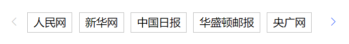

::: tip 功能

需封装这样一个组件：如下图所示：</br>
</br>
要求：</br>
1、整体宽度自适应</br>
2、左右按钮可使展示区域内容左右切换</br>
:::

## 思路

视图部分：

```vue
<div id="box" class="box">
      <div
        class="icon"
        :style="startIndex == 0 ? 'color:#CCCCCC' : 'color:#3e79fe;'"
        style="position:absolute;left:0"
        @click="tabLeft"
      >
        <i class="el-icon-arrow-left" />
      </div>
      // 用来控制div移动，并加移动效果
      <div
        class="good_city"
        :style="'transform: translateX(' + tabIndex + 'px);'"
      >
        <div class="tabsBox">
          <span
            v-for="item in tabsList"
            :id="'tab' + item.id"
            :key="item.label"
            class="tab"
            :class="tabClick == item.id ? 'tabClick' : ''"
            @click="clickTab(item)"
          >
            {{ item.value }}
          </span>
        </div>
      </div>
      <div
        class="icon"
        :style="
          endIndex == tabsList.length - 1 ? 'color:#CCCCCC' : 'color:#3e79fe;'
        "
        style="position:absolute;right:0"
        @click="tabRight"
      >
        <i class="el-icon-arrow-right" />
      </div>
    </div>
```

数据部分：

```js
//后期tabslist、需要通过组件传进来
data() {
    return {
      //   tabsList: []
      tabClick: 0, // 选择的tab
      tabIndex: 0, // tab需要移动的宽
      startIndex: 0, // display展示的起始div索引
      endIndex: 0, // display展示的终止div索引
      tabsList: [
        { id: 1, label: '0', value: '人民网' },
        { id: 2, label: '1', value: '新华网' },
        { id: 3, label: '2', value: '中国日报' },
        { id: 4, label: '3', value: '华盛顿邮报' },
        { id: 5, label: '4', value: '央广网' },
        { id: 6, label: '5', value: '央广网2' },
        { id: 7, label: '6', value: '央广网3' },
        { id: 8, label: '7', value: '央广网4' }
      ]
    };
  },
```

功能部分：

```js
mounted() {
    this.getTabWidth();
    this.setDisplayTab(0);
},
methods: {
// 获取每个tab的宽度，放在 tabslist 中
    getTabWidth() {
      this.tabsList.forEach((item, index) => {
        this.tabsList[index].width = document.getElementById(
          'tab' + item.id
        ).clientWidth;
      });
      console.log(this.tabsList);
    },
    setDisplayTab(inx) {
      // 参数：起始索引
      // 当前展示起始索引startIndex，box宽度，计算<box的索引endIndex，start-end展示，其他隐藏
      // 可展示区域宽度 -- 即box div宽度
      debugger;
      this.fatherWidth = document.getElementById('box').clientWidth;
      let sumWidth = 0;
      this.tabsList.forEach((item, index) => {
        if (index >= inx) {
          sumWidth = sumWidth + item.width + 12;
          // this.endIndex = index;
          if (this.fatherWidth >= sumWidth) {
            document.getElementById('tab' + item.id).style.display =
              'inline-block';
            this.endIndex = index;
          } else {
            document.getElementById('tab' + item.id).style.display = 'none';
          }
        }
      });
    },
    clickTab(it) {
      this.indexBefore = 0; // 之前选中的div
      this.indexNow = 0; // 当前选中的div
      // this.tabidnow = 0; // 需要移动的宽
      this.tabsList.forEach((item, index) => {
        if (item.id === this.tabClick) {
          this.indexBefore = index;
        }
        if (it.id === item.id) {
          this.indexNow = index;
        }
      });
      this.tabClick = it.id;
    },
    tabLeft() {
      // 移动距离tabindex=startIndex-1的宽度，调用setDisplayTab控制显隐
      // 判断是否为初始位置
      if (this.startIndex !== 0) {
        // 向左移动，起始位置-1
        this.startIndex--;
        this.setDisplayTab(this.startIndex);
        this.tabIndex += this.tabsList[this.startIndex].width + 12;
      }
    },
    tabRight() {
      if (this.endIndex < this.tabsList.length - 1) {
        const tabStartBeforeIndex = this.startIndex;
        this.startIndex++;
        this.setDisplayTab(this.startIndex);
        this.tabIndex -= this.tabsList[tabStartBeforeIndex].width + 12;
      }
    }
}
```

样式部分：

```css
.box {
    width: 100%;
    padding: 0 30px;
    //   min-width: 535px;
    display: flex;
    justify-content: space-between;
    overflow: hidden;
    position: relative;
    .good_city {
        width: 9999px; //这里其实不应该写死 应该写成动态赋值 这里我就先写死
        height: 30px;
        transition: all 0.5s;
    }
    .tabsBox {
        width: 9999px;
        height: 30px;
        display: flex;
        justify-content: flex-start;
        flex-wrap: nowrap;
        overflow: hidden;
        .tab {
            height: 30px;
            //   min-width: 84px;
            padding: 0px 8px;
            margin: 0 5px;
            line-height: 30px;
            border: 1px solid #bbbbbb;
            cursor: pointer;
            text-align: center;
            float: left;
            //   flex-shrink: 1;
        }
        .tabClick {
            background: #3e79fe;
            color: #ffffff;
        }
    }
    .icon {
        text-align: center;
        line-height: 30px;
        padding: 0 8px;
        cursor: pointer;
        background-color: white;
        z-index: 10000;
    }
}
```
