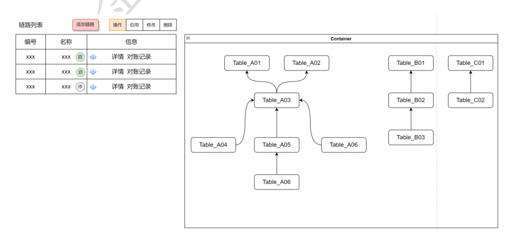

### 前端图形库调研--流程图相关

需求：全链路对账一期优化中有这样一个需求，要求根据左侧列表关系实现右侧图的展示。如下图：

根据以上需求，前端共调研了三种技术去实现，分别为：AntV X6 的 DAG 有向无环图、D3.js、AntV G6。

#### 1、AntV X6 的 DAG 有向无环图

[案例链接](https://x6.antv.antgroup.com/zh/examples/showcase/practices/#dag)
[教程链接](https://x6.antv.antgroup.com/tutorial/about)
[API 链接](https://x6.antv.antgroup.com/api/graph/graph)

代码实现：
1、安装 Antv X6 包

```js
npm install @antv/x6 --save
```

2、代码实现：

```vue
<template>
  <div style="width=100%; height=100%">
    <div id="container"></div>
  </div>
</template>
<script lang="ts">
import { Graph } from "@antv/x6";
// import { Snapline } from '@antv/x6-plugin-snapline'
import { onMounted } from "vue";
import { nodes, edges } from "./data";
export default {
  setup() {
    onMounted(() => {
      const graph = new Graph({
        container: document.getElementById("container"),
        //画布大小自适应
        autoResize: true,
        width: 800,
        height: 600,
        // 通过 background 和 grid 两个配置来设置画布的背景以及网格。
        background: {
          color: "#F2F7FA",
        },
        grid: {
          visible: true,
          type: "doubleMesh",
          args: [
            {
              color: "#eee", // 主网格线颜色
              thickness: 1, // 主网格线宽度
            },
            {
              color: "#ddd", // 次网格线颜色
              thickness: 1, // 次网格线宽度
              factor: 4, // 主次网格线间隔
            },
          ],
        },
        // panning,mousewheel实现画布的平移和缩放
        panning: true,
        // mousewheel: true,
        mousewheel: {
          enabled: true,
          modifiers: "Ctrl",
        },
      });
      const obj = {};
      nodes.forEach((item) => {
        item.shape = "rect";
        item.width = 80;
        item.height = 40;
        obj[item.label] = graph.addNode(item);
      });
      edges.forEach((item) => {
        item.shape = "edge";
        item.source = obj[item.source];
        item.target = obj[item.target];
        graph.addEdge(item);
      });
    });
  },
};
</script>
```

data.js

```js
export const nodes = [
  {
    x: 100,
    y: 200,
    label: "Table_A01",
    id: "Table_A01",
  },
  {
    x: 300,
    y: 200,
    label: "Table_A02",
    id: "Table_A02",
  },
  {
    x: 200,
    y: 300,
    label: "Table_A03",
    id: "Table_A03",
  },
  {
    x: 0,
    y: 400,
    label: "Table_A04",
    id: "Table_A04",
  },
  {
    x: 200,
    y: 400,
    label: "Table_A05",
    id: "Table_A05",
  },
  {
    x: 400,
    y: 400,
    label: "Table_A06",
    id: "Table_A06",
  },
  {
    x: 200,
    y: 500,
    label: "Table_A07",
    id: "Table_A07",
  },
];
export const edges = [
  {
    source: "Table_A03",
    target: "Table_A01",
  },
  {
    source: "Table_A03",
    target: "Table_A02",
  },
  {
    source: "Table_A04",
    target: "Table_A03",
  },
  {
    source: "Table_A05",
    target: "Table_A03",
  },
  {
    source: "Table_A06",
    target: "Table_A01",
  },
  {
    source: "Table_A07",
    target: "Table_A05",
  },
];
```

> **缺点**：每一个节点的渲染都需要确定的 X，Y 轴坐标信息，而后端无法提供坐标位置信息。这个技术更适合去实现流程图画图工具

#### 2、通过 D3 实现流程图

[链接：](https://blog.csdn.net/weixin_47319740/article/details/108408172)


1、安装 D3 依赖包

```js
npm install d3
npm install dagre-d3
```

代码：

```vue
<template>
  <div style="border: 1px solid #ccc; padding: 20px; width: 600px">
    <svg class="dagre" width="1600" height="1000">
      <g class="container"></g>
    </svg>
  </div>
  <!-- <div ref="tooltip" class="tooltip">
        <div>节点ID：{{ currentNode.id }}</div>
        <div>节点名称：{{ currentNode.nodeName }}</div>
    </div> -->
</template>
<script lang="ts" setup>
import { onMounted } from "vue";
import { dataSet } from "./data";
import dagreD3 from "dagre-d3";
import * as d3 from "d3";
// 设置节点和连线
let tooltip;
const renderGagre = () => {
  tooltip = createTooltip();
  // 创建graph对象
  console.log(dataSet);

  const g = new dagreD3.graphlib.Graph();
  // 设置图
  g.setGraph({
    rankdir: "LR", // T:top B:bottom
    marginx: 60,
    marginy: 80,
    edgesep: 100,
    ranksep: 60,
  });
  dataSet.nodes.forEach((item) => {
    g.setNode(item.id, {
      // 节点标签
      label: item.label,
      // 节点形状
      shape: item.shape || "rect", ////节点形状，可以设置rect(长方形),circle,ellipse(椭圆),diamond(菱形) 四种形状，还可以使用render.shapes()自定义形状
      toolText: item.toolText,
      // 节点样式
      style: item.color ? item.color : "fill:#FFFFFF;stroke:#000000", //节点样式,可设置节点的颜色填充、节点边框
      labelStyle: "fill:#000000;", //节点标签样式, 可设置节点标签的文本样式（颜色、粗细、大小）
      width: 83,
      height: 40,
      rx: 5, // 设置圆角
      ry: 5, // 设置圆角
      paddingBottom: 15,
      paddingLeft: 20,
      paddingRight: 20,
      paddingTop: 15,
    });
  });
  dataSet.edges.forEach((item) => {
    g.setEdge(item.source, item.target, {
      // 边标签
      label: item.label,
      arrowheadStyle: item.color ? item.color : "fill:#000000;", // 根据后台数据来改变连线箭头的颜色
      // 边样式
      style: item.color
        ? item.color
        : "fill:#ffffff;stroke:#000000;stroke-width:1.5px", // 根据后台数据来改变连线的颜色
      // arrowhead: 'normal', //箭头形状，可以设置 normal,vee,undirected 三种样式，默认为 normal
    });
  });
  // 创建渲染器
  const render = new dagreD3.render();
  // 选择svg并添加一个g元素作为绘图容器
  const svgGroup = d3.select("svg.dagre").append("g");
  // 建立拖拽缩放
  const svg = d3.select("svg.dagre");
  const zoom = d3.zoom().on("zoom", function (current) {
    svgGroup.attr("transform", current.transform);
  });
  // let zoom = d3
  //     .zoom()
  //     .scaleExtent([0.5, 2])
  //     .on('zoom', function (current) {
  //         svgGroup.attr('transform', current.transform)
  //     })
  svg.call(zoom);

  // 在绘图容器上运行渲染器生成流程图
  render(svgGroup, g);

  // 鼠标悬停显示隐藏tooptip
  console.log(svgGroup.selectAll("g.node"));

  svgGroup
    .selectAll("g.node")
    .on("mouseover", (v) => {
      // debugger
      console.log(v, "v");
      console.log(g.node(v), "g.node(v)");
      console.log(g.node(), "g.node()");

      // 假如当前toolText为"",则不展示
      if (g.node(v).toolText === "") {
        return;
      }
      tipVisible(g.node(v).toolText);
    })
    .on("mouseout", () => {
      tipHidden();
    });
  // const currentNode = {
  //     id: null,
  //     nodeName: '',
  // }
  // const that = this
  // const tooltipBox = that.$refs.tooltip
  // svgGroup
  //     .on('mouseover', (e) => {
  //         currentNode = that.nodes.filter(
  //             (item) => item.id === Number(e.target.__data__)
  //         )[0]
  //         tooltipBox.style.display = 'block'
  //         tooltipBox.style.top = e.clientY + 20 + 'px'
  //         tooltipBox.style.left = e.clientX + 'px'
  //     })
  //     .on('mouseout', function () {
  //         tooltipBox.style.display = 'none'
  //     })
};
const createTooltip = () => {
  return d3
    .select("body")
    .append("div")
    .classed("tooltip", true)
    .style("opacity", 0)
    .style("display", "none");
};
// tooltip显示
const tipVisible = (textContent) => {
  tooltip
    .transition()
    .duration(400)
    .style("opacity", 0.9)
    .style("display", "block");
  tooltip
    .html(textContent)
    .style("left", `${d3.event.pageX + 15}px`)
    .style("top", `${d3.event.pageY + 15}px`);
};
// tooltip隐藏
const tipHidden = () => {
  tooltip
    .transition()
    .duration(400)
    .style("opacity", 0)
    .style("display", "none");
};
onMounted(() => {
  renderGagre();
});
</script>
<style scoped>
.tooltip {
  position: absolute;
  font-size: 12px;
  text-align: center;
  background-color: white;
  border-radius: 3px;
  box-shadow: rgb(174, 174, 174) 0px 0px 10px;
  cursor: pointer;
  display: inline-block;
  padding: 10px;
}

.tooltip > div {
  padding: 10px;
}
</style>
```

data.js

```js
export const dataSet = {
  nodes: [
    {
      id: "Table_A01",
      label: "Table_A01",
      shape: "rect",
      // color: 'fill:#d81b13;stroke:transparent',
      toolText: "111",
    },
    {
      id: "Table_A02",
      label: "Table_A02",
      shape: "rect",
      color: "",
      toolText: "",
    },
    {
      id: "Table_A03",
      label: "Table_A03",
      shape: "rect",
      color: "",
      toolText: "",
    },
    {
      id: "Table_A04",
      label: "Table_A04",
      shape: "rect",
      color: "",
      toolText: "",
    },
    {
      id: "Table_A05",
      label: "Table_A05",
      shape: "rect",
      color: "",
      toolText: "",
    },
    {
      id: "Table_A06",
      label: " Table_A06 ",
      shape: "rect",
      color: "",
      toolText: "",
    },
    {
      id: "Table_A07",
      label: " Table_A07 ",
      shape: "rect",
      color: "",
      toolText: "",
    },
    {
      id: "Table_B01",
      label: " Table_B01 ",
      shape: "rect",
      color: "",
      toolText: "",
    },
    {
      id: "Table_B02",
      label: " Table_B02 ",
      shape: "rect",
      color: "",
      toolText: "",
    },
    {
      id: "Table_B03",
      label: " Table_B03 ",
      shape: "rect",
      color: "",
      toolText: "",
    },
    {
      id: "Table_C01",
      label: " Table_C01 ",
      shape: "rect",
      color: "",
      toolText: "",
    },
    {
      id: "Table_C02",
      label: " Table_C02 ",
      shape: "rect",
      color: "",
      toolText: "",
    },
  ],
  edges: [
    {
      id: 1,
      source: "Table_A03",
      target: "Table_A01",
      label: "merge1和merge2",
      color: "",
    },
    {
      id: 1,
      source: "Table_A02",
      target: "Table_A04",
      label: "",
      color: "",
    },
    {
      id: 1,
      source: "Table_A04",
      target: "Table_A03",
      label: "",
      color: "",
    },
    {
      id: 1,
      source: "Table_A06",
      target: "Table_A03",
      label: "",
      color: "",
    },
    {
      id: 1,
      source: "Table_A05",
      target: "Table_A03",
      label: "",
      color: "",
    },
    {
      id: 1,
      source: "Table_A05",
      target: "Table_A07",
      label: "",
      color: "",
    },
    {
      id: 1,
      source: "Table_B02",
      target: "Table_B01",
      label: "",
      color: "",
    },
    {
      id: 1,
      source: "Table_B03",
      target: "Table_B02",
      label: "",
      color: "",
    },
    {
      id: 1,
      source: "Table_C02",
      target: "Table_C01",
      label: "",
      color: "",
    },
    // { id: 2, source: 1, target: 4, label: '', color: '' },
    // { id: 3, source: 2, target: 3, label: '', color: '' },
    // { id: 4, source: 5, target: 1, label: '', color: '' },
    // { id: 5, source: 4, target: 5, label: '', color: '' },
    // { id: 6, source: 2, target: 5, label: '', color: '' },
  ],
};
```

> 缺点：对于需求中的部分功能无法实现：比如点击或者悬浮在边节点时，无法展示边连接的字段信息

#### 3、通过 AntV G6 实现流程图

[案例链接](https://g6.antv.antgroup.com/examples/net/dagreFlow/#basicDagre)
[教程链接](https://g6.antv.antgroup.com/manual/introduction)
[API 链接](https://g6.antv.antgroup.com/api/Graph)


```vue
<template>
  <div style="width=100%; height=100%;margin-left:20px;overflow-x: auto;">
    <div id="container"></div>
  </div>
</template>
<script lang="ts" setup>
import G6 from "@antv/g6";
import { onMounted } from "vue";
import { G6Data } from "./data";
const renderDAG = () => {
  if (this.charts) {
    this.charts.destroy();
  }
  // 自定义节点
  G6.registerNode(
    "sql",
    {
      drawShape(cfg, group) {
        const rect = group.addShape("rect", {
          attrs: {
            x: -75,
            y: -25,
            width: 150,
            height: 50,
            radius: 10,
            stroke: "#5B8FF9",
            fill: "#C6E5FF",
            lineWidth: 3,
          },
          name: "rect-shape",
        });
        if (cfg.name) {
          group.addShape("text", {
            attrs: {
              text: cfg.name,
              x: 0,
              y: 0,
              fill: "#00287E",
              fontSize: 14,
              textAlign: "center",
              textBaseline: "middle",
              fontWeight: "bold",
            },
            name: "text-shape",
          });
        }
        return rect;
      },
    },
    "single-node"
  );
  const container = document.getElementById("container");
  // const width = container.scrollWidth || 800
  // const height = container.scrollHeight || 800
  const graph = new G6.Graph({
    container: "container",
    width: 960,
    height: 800,
    layout: {
      type: "dagre",
      nodesepFunc: (d) => {
        if (d.id === "3") {
          return 500;
        }
        return 50;
      },
      ranksep: 70,
      controlPoints: true,
    },
    //默认情况下全局节点的配置项，包括样式属性和其他属性
    defaultNode: {
      type: "sql",
    },
    // 默认情况下全局边的配置项，包括样式属性和其他属性
    defaultEdge: {
      type: "polyline",
      style: {
        radius: 20,
        offset: 45,
        endArrow: true,
        lineWidth: 2,
        stroke: "#C2C8D5",
      },
    },
    // 除默认状态外的其他状态下节点的样式配置
    nodeStateStyles: {
      selected: {
        stroke: "#d9d9d9",
        fill: "#5394ef",
      },
      highlight: {
        fill: "#db4437",
        shadowColor: "#fff",
        stroke: "#db4437",
        cursor: "pointer",
        "text-shape": {
          lineWidth: 1,
          fill: "#db4437",
          stroke: "#db4437",
        },
      },
    },
    edgeStateStyles: {}, // 配置边状态样式
    comboStateStyles: {}, // 配置分组状态样式
    // 配置多种交互模式及其包含的交互事件的
    modes: {
      default: [
        "drag-canvas",
        "zoom-canvas",
        "click-select",
        {
          type: "activate-relations",
          activeState: "active",
          inactiveState: "inactive",
        },
        {
          type: "tooltip", // 节点提示框
          formatText(model) {
            // const cfg = model.conf
            // const text = []
            // cfg.forEach((row) => {
            //     text.push(
            //         row.label + ':' + row.value + '<br>'
            //     )
            // })
            // return text.join('\n')
            return model.suspended;
          },
          offset: 50,
        },
        {
          type: "edge-tooltip", // 边提示框
          formatText(model) {
            // 边提示框文本内容
            return model.suspended;
          },
        },
      ],
    },
    fitView: true,
  });
  console.log(G6Data);

  // graph.destroy()
  this.charts = graph;
  graph.data(G6Data);
  graph.render();
  graph.on("combo:mouseenter", (e) => {
    let edgeItem = e.item;
    graph.setItemState(edgeItem, "highlight", true);
    edgeItem.getEdges().forEach((edge) => {
      graph.setItemState(edge.getTarget(), "highlight", true);
      graph.setItemState(edge.getSource(), "highlight", true);
      graph.setItemState(edge, "highlight", true);
    });
    graph.paint();
    graph.setAutoPaint(true);
  });

  graph.on("combo:mouseleave", (e) => {
    graph.setAutoPaint(false);
    graph.getNodes().forEach((node) => {
      graph.clearItemStates(node);
    });
    graph.getEdges().forEach((edge) => {
      graph.clearItemStates(edge);
    });
    graph.getCombos().forEach((combo) => {
      graph.clearItemStates(combo);
    });
    graph.paint();
    graph.setAutoPaint(true);
  });
};
onMounted(() => {
  renderDAG();
});
</script>
```

data.js

```js
export const G6Data = {
  nodes: [
    {
      id: "Table_A01",
      // dataType: 'alps',
      name: "Table_A01",
      suspended: "士大夫随风倒",
    },
    {
      id: "Table_A02",
      // dataType: 'alps',
      name: "Table_A02",
      suspended: "士大夫随风倒",
    },
    {
      id: "Table_A03",
      // dataType: 'alps',
      name: "Table_A03",
      suspended: "士大夫随风倒",
    },
    {
      id: "Table_A04",
      // dataType: 'sql',
      name: "Table_A04",
      suspended: "士大夫随风倒",
    },
    {
      id: "Table_A05",
      // dataType: 'sql',
      name: "Table_A05",
      suspended: "士大夫随风倒",
    },
    {
      id: "Table_A06",
      // dataType: 'feature_etl',
      name: "Table_A06",
      suspended: "士大夫随风倒",
    },
    {
      id: "Table_A07",
      // dataType: 'feature_etl',
      name: "Table_A07",
      suspended: "士大夫随风倒",
    },
    {
      id: "Table_B01",
      // dataType: 'feature_extractor',
      name: "Table_B01",
      conf: [
        {
          label: "conf",
          value: "pai_graph.conf",
        },
        {
          label: "dot",
          value: "pai_graph.dot",
        },
        {
          label: "init",
          value: "init.rc",
        },
      ],
    },
    {
      id: "Table_B02",
      // dataType: 'feature_extractor',
      name: "Table_B02",
      suspended: "士大夫随风倒",
    },
    {
      id: "Table_B03",
      // dataType: 'feature_extractor',
      name: "Table_B03",
      suspended: "士大夫随风倒",
    },
    {
      id: "Table_C01",
      // dataType: 'feature_extractor',
      name: "Table_C01",
      suspended: "士大夫随风倒",
    },
    {
      id: "Table_C02",
      // dataType: 'feature_extractor',
      name: "Table_C02",
      suspended: "士大夫随风倒",
    },
  ],
  edges: [
    {
      source: "Table_A02",
      target: "Table_A04",
      suspended: "的温热我认为",
    },
    {
      source: "Table_A04",
      target: "Table_A03",
      suspended: "的温热我认为",
    },
    {
      source: "Table_A06",
      target: "Table_A03",
      suspended: "的温热我认为",
    },
    {
      source: "Table_A05",
      target: "Table_A03",
      suspended: "的温热我认为",
    },
    {
      source: "Table_A05",
      target: "Table_A07",
      suspended: "的温热我认为",
    },
    {
      source: "Table_B02",
      target: "Table_B01",
      suspended: "的温热我认为",
    },
    {
      source: "Table_B03",
      target: "Table_B02",
      suspended: "的温热我认为",
    },
    {
      source: "Table_C02",
      target: "Table_C01",
      label: "Table_C02----Table_C01",
      suspended: "的温热我认为",
    },
    {
      source: "Table_A02",
      target: "Table_A01",
      suspended: "所发生的郭德纲",
    },
    {
      source: "Table_A02",
      target: "Table_A01",
      suspended: "所发生的郭德纲",
    },
  ],
};
```

遇到的问题：
1、ref 调取子组件的方法

```js
// vue3写法
const dagImage = ref(null);
dagImage.value.renderDAG(res.data.data);
// vue2写法
this.$refs.dagImage.renderDAG(res.data.data);
```

2、销毁流程图-变量变为全局变量
父组件采用组合式写法，子组件使用选项式写法，这样子组件的 graph 就可以赋值给全局变量，这样再销毁就可以了
