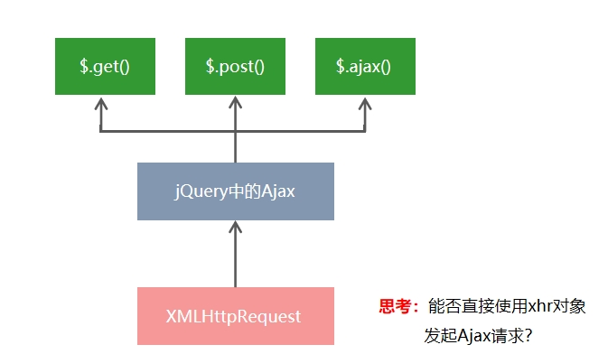

> Ajax

# 一、jquery 中的 ajax

浏览器中提供的 XMLHttpRequest 用法比较复杂，所以 jQuery 对 XMLHttpRequest 进行了封装，提供了一系列 Ajax 相关的函数，极大地降低了 Ajax 的使用难度。
jQuery 中发起 Ajax 请求最常用的三个方法如下：

- $.get()
- $.post()
- $.ajax()

## 1、$.get()函数的语法

jQuery 中 $.get() 函数的功能单一，专门用来发起 get 请求，从而将服务器上的资源请求到客户端来进行使用。
$.get() 函数的语法如下：

```js
$.get(url, [data], [callback]);
```

其中，三个参数各自代表的含义如下：
|参数名|参数类型|是否必选|说明|
| ------ | :--: | :--: | ---: |
url|string|是|要请求的资源地址
data|Object|否|请求资源期间要携带的参数
callback|function|否|请求成功时的回调函数

## 2、$.get()发起不带参数的请求

使用 $.get() 函数发起不带参数的请求时，直接提供请求的 URL 地址和请求成功之后的回调函数即可，示例代码如下：

```
$.get('http://www.liulongbin.top:3006/api/getbooks', function(res) {
    console.log(res) // 这里的 res 是服务器返回的数据
})

```

## 3、$.post()函数的语法

jQuery 中 $.post() 函数的功能单一，专门用来发起 post 请求，从而向服务器提交数据。
$.post() 函数的语法如下：

```
$.post(url, [data], [callback])
```

## 4、$.ajax()函数的语法

相比于 $.get() 和 $.post() 函数，jQuery 中提供的 $.ajax() 函数，是一个功能比较综合的函数，它允许我们对 Ajax 请求进行更详细的配置。
$.ajax() 函数的基本语法如下：

```
$.ajax({
   type: '', // 请求的方式，例如 GET 或 POST
   url: '',  // 请求的 URL 地址
   data: { },// 这次请求要携带的数据
   success: function(res) { } // 请求成功之后的回调函数
})
```

# 二、AJAX 加强

## 1、XMLHttpRequest 的基本使用

### 1.1 什么 XMLHttpRequest

XMLHttpRequest（简称 xhr）是浏览器提供的 Javascript 对象，通过它，可以请求服务器上的数据资源。之前所学的 jQuery 中的 Ajax 函数，就是基于 xhr 对象封装出来的。


### 1.2 使用 xhr 发起 GET 请求

步骤：

1. 创建  xhr  对象
2. 调用  xhr.open()  函数
3. 调用  xhr.send()  函数
4. 监听  xhr.onreadystatechange  事件

```js
// 1. 创建 XHR 对象
var xhr = new XMLHttpRequest();
// 2. 调用 open 函数，指定 请求方式 与 URL地址
xhr.open("GET", "http://www.liulongbin.top:3006/api/getbooks");
// 3. 调用 send 函数，发起 Ajax 请求
xhr.send();
// 4. 监听 onreadystatechange 事件
xhr.onreadystatechange = function () {
  // 4.1 监听 xhr 对象的请求状态 readyState ；与服务器响应的状态 status
  if (xhr.readyState === 4 && xhr.status === 200) {
    // 4.2 打印服务器响应回来的数据
    console.log(xhr.responseText);
  }
};
```

### 1.3 了解 xhr 对象的 readyState 属性

XMLHttpRequest 对象的 readyState 属性，用来表示当前 Ajax 请求所处的状态。每个 Ajax 请求必然处于以下状态中的一个：
|值|状态|描述|
| ------ | :--: | :--: |
0|UNSENT|XMLHttpRequest 对象已被创建，但尚未调用 open 方法。
1|OPENED|open()  方法已经被调用。
2| HEADERS_RECEIVED| send() 方法已经被调用，响应头也已经被接收。
3| LOADING |数据接收中，此时 response 属性中已经包含部分数据。
4| DONE| Ajax 请求完成，这意味着数据传输已经彻底完成或失败。

### 1.4 查询字符串

定义：查询字符串（URL 参数）是指在 URL 的末尾加上用于向服务器发送信息的字符串（变量）。
格式：将英文的 ? 放在 URL 的末尾，然后再加上 参数＝值 ，想加上多个参数的话，使用 & 符号进行分隔。以这个形式，可以将想要发送给服务器的数据添加到 URL 中。

```js
// 不带参数的 URL 地址
http://www.liulongbin.top:3006/api/getbooks
// 带一个参数的 URL 地址
http://www.liulongbin.top:3006/api/getbooks?id=1
// 带两个参数的 URL 地址
http://www.liulongbin.top:3006/api/getbooks?id=1&bookname=西游记
```

无论使用 $.ajax()，还是使用 $.get()，又或者直接使用 xhr 对象发起 GET 请求，当需要携带参数的时候，本质上，都是直接将参数以查询字符串的形式，追加到 URL 地址的后面，发送到服务器的

```
$.get('url', {name: 'zs', age: 20}, function() {})
// 等价于
$.get('url?name=zs&age=20', function() {})

$.ajax({ method: 'GET', url: 'url', data: {name: 'zs', age: 20}, success: function() {} })
// 等价于
$.ajax({ method: 'GET', url: 'url?name=zs&age=20', success: function() {} })
```

### 1.5 URL 编码与解码

1. 什么是 URL 编码
   URL 地址中，只允许出现英文相关的字母、标点符号、数字，因此，在 URL 地址中不允许出现中文字符。
   如果 URL 中需要包含中文这样的字符，则必须对中文字符进行编码（转义）。
   URL 编码的原则：使用安全的字符（没有特殊用途或者特殊意义的可打印字符）去表示那些不安全的字符。
   URL 编码原则的通俗理解：使用英文字符去表示非英文字符。

```
http://www.liulongbin.top:3006/api/getbooks?id=1&bookname=西游记
// 经过 URL 编码之后，URL地址变成了如下格式：
http://www.liulongbin.top:3006/api/getbooks?id=1&bookname=%E8%A5%BF%E6%B8%B8%E8%AE%B0
```

2. 如何对 URL 进行编码与解码
   浏览器提供了 URL 编码与解码的 API，分别是：

- encodeURI() 编码的函数
- decodeURI() 解码的函数

```
encodeURI('黑马程序员')
// 输出字符串  %E9%BB%91%E9%A9%AC%E7%A8%8B%E5%BA%8F%E5%91%98
decodeURI('%E9%BB%91%E9%A9%AC')
// 输出字符串  黑马
```

由于浏览器会自动对 URL 地址进行编码操作，因此，大多数情况下，程序员不需要关心 URL 地址的编码与解码操作。

### 1.7 使用 xhr 发起 POST 请求

- 创建  xhr  对象
- 调用  xhr.open()  函数
- 设置  Content-Type  属性（固定写法）
- 调用  xhr.send()  函数，同时指定要发送的数据
- 监听  xhr.onreadystatechange  事件

```js
// 1. 创建 xhr 对象
var xhr = new XMLHttpRequest();
// 2. 调用 open()
xhr.open("POST", "http://www.liulongbin.top:3006/api/addbook");
// 3. 设置 Content-Type 属性（固定写法）
xhr.setRequestHeader("Content-Type", "application/x-www-form-urlencoded");
// 4. 调用 send()，同时将数据以查询字符串的形式，提交给服务器
xhr.send("bookname=水浒传&author=施耐庵&publisher=天津图书出版社");
// 5. 监听 onreadystatechange 事件
xhr.onreadystatechange = function () {
  if (xhr.readyState === 4 && xhr.status === 200) {
    console.log(xhr.responseText);
  }
};
```

## 2、数据交换格式

### 2.1 什么是数据交换格式

数据交换格式，就是`服务器端`与`客户端`之间进行`数据传输与交换的格式`。
前端领域，经常提及的两种数据交换格式分别是 `XML` 和 `JSON`。其中 XML 用的非常少，所以，我们重点要学习的数据交换格式就是 JSON。

### 2.2 XML

XML 的英文全称是 EXtensible Markup Language，即可扩展标记语言。因此，XML 和 HTML 类似，也是一种标记语言。


1. XML 和 HTML 的区别

XML 和 HTML 虽然都是标记语言，但是，它们两者之间没有任何的关系。

- HTML 被设计用来描述网页上的内容，是网页内容的载体
- XML 被设计用来传输和存储数据，是数据的载体
  

2. XML 的缺点

   XML 格式臃肿，和数据无关的代码多，体积大，传输效率低
   在 Javascript 中解析 XML 比较麻烦

### 2.3 JSON

概念：JSON 的英文全称是 JavaScript Object Notation，即“JavaScript 对象表示法”。简单来讲，`JSON 就是 Javascript 对象和数组的字符串表示法`，它使用文本表示一个 JS 对象或数组的信息，因此，JSON 的本质是字符串。
作用：JSON 是一种`轻量级的文本数据交换格式`，在作用上类似于 XML，专门用于存储和传输数据，但是 JSON 比 XML `更小、更快、更易解析`。
现状：JSON 是在 2001 年开始被推广和使用的数据格式，到现今为止，`JSON 已经成为了主流的数据交换格式`。

1. JSON 的两种结构

JSON 就是用字符串来表示 Javascript 的对象和数组。所以，JSON 中包含`对象`和`数组`两种结构，通过这两种结构的`相互嵌套`，可以表示各种复杂的数据结构。
`对象结构`：对象结构在 JSON 中表示为 { } 括起来的内容。数据结构为 { key: value, key: value, … } 的键值对结构。其中，key 必须是使用`英文的双引号包裹的字符串`，value 的数据类型可以是`数字、字符串、布尔值、null、数组、对象`6 种类型。

`数组结构`：数组结构在 JSON 中表示为 [ ] 括起来的内容。数据结构为 [ "java", "javascript", 30, true … ] 。数组中数据的类型可以是`数字、字符串、布尔值、null、数组、对象`6 种类型。

```
[ "java", "python", "php" ]
[ 100, 200, 300.5 ]
[ true, false, null ]
[ { "name": "zs", "age": 20}, { "name": "ls", "age": 30} ]
[ [ "苹果", "榴莲", "椰子" ], [ 4, 50, 5 ] ]
```

3. JSON 语法注意事项

- 属性名必须使用双引号包裹
- 字符串类型的值必须使用双引号包裹
- JSON 中不允许使用单引号表示字符串
- JSON 中不能写注释
- JSON 的最外层必须是对象或数组格式
- 不能使用 undefined 或函数作为 JSON 的值

  `JSON 的作用`：在计算机与网络之间存储和传输数据。
  `JSON 的本质`：用字符串来表示 Javascript 对象数据或数组数据

4. JSON 和 JS 对象的互转

从 JSON 字符串转换为 JS 对象，使用 `JSON.parse()` 方法：

```
var obj = JSON.parse('{"a": "Hello", "b": "World"}')
//结果是 {a: 'Hello', b: 'World'}
```

JS 对象转换为 JSON 字符串，使用 `JSON.stringify()` 方法

```
var json = JSON.stringify({a: 'Hello', b: 'World'})
//结果是 '{"a": "Hello", "b": "World"}'

```

把`数据对象转换为字符串`的过程，叫做`序列化`，例如：调用 JSON.stringify() 函数的操作，叫做 JSON 序列化。
把`字符串转换为数据对象`的过程，叫做`反序列化`，例如：调用 JSON.parse() 函数的操作，叫做 JSON 反序列化。

## 3、axios

Axios 是专注于`网络数据请求`的库。
相比于原生的 XMLHttpRequest 对象，axios `简单易用`。
相比于 jQuery，axios 更加`轻量化`，只专注于网络数据请求。

### 3.1 axios 发起 GET 请求

```
axios.get('url', { params: { /*参数*/ } }).then(callback)
```

```js
// 请求的 URL 地址
var url = "http://www.liulongbin.top:3006/api/post";
// 要提交到服务器的数据
var dataObj = { location: "北京", address: "顺义" };
// 调用 axios.post() 发起 POST 请求
axios.post(url, dataObj).then(function (res) {
  // res.data 是服务器返回的数据
  var result = res.data;
  console.log(result);
});
```

直接使用 axios 发起请求:
axios 也提供了类似于 jQuery 中 $.ajax() 的函数，语法如下：

```js
axios({
  method: "请求类型",
  url: "请求的URL地址",
  data: {
    /* POST数据 */
  },
  params: {
    /* GET参数 */
  },
}).then(callback);

//直接使用axios发起GET请求;
axios({
  method: "GET",
  url: "http://www.liulongbin.top:3006/api/get",
  params: {
    // GET 参数要通过 params 属性提供
    name: "zs",
    age: 20,
  },
}).then(function (res) {
  console.log(res.data);
});
//直接使用axios发起POST请求
axios({
  method: "POST",
  url: "http://www.liulongbin.top:3006/api/post",
  data: {
    // POST 数据要通过 data 属性提供
    bookname: "程序员的自我修养",
    price: 666,
  },
}).then(function (res) {
  console.log(res.data);
});
```

# 三、跨域与 JSONP

## 1、同源策略

1. 同源

如果两个页面的协议，域名和端口都相同，则两个页面具有相同的源。


2. 同源策略
   > 同源策略（英文全称 Same origin policy）是浏览器提供的一个安全功能。
   > MDN 官方给定的概念：同源策略限制了从同一个源加载的文档或脚本如何与来自另一个源的资源进行交互。这是一个用于隔离潜在恶意文件的重要安全机制。
   > 通俗的理解：浏览器规定，A 网站的 JavaScript，不允许和非同源的网站 C 之间，进行资源的交互，例如：
   > 无法读取非同源网页的 Cookie、LocalStorage 和 IndexedDB
   > 无法接触非同源网页的 DOM
   > 无法向非同源地址发送 Ajax 请求
3. 什么是跨域

同源指的是两个 URL 的协议、域名、端口一致，反之，则是跨域。
出现跨域的根本原因：浏览器的同源策略不允许非同源的 URL 之间进行资源的交互。
网页：http://www.test.com/index.html
接口：http://www.api.com/userlist


4. 如何实现跨域数据请求

现如今，实现跨域数据请求，最主要的两种解决方案，分别是 `JSONP` 和 `CORS`。
JSONP：出现的早，兼容性好（兼容低版本 IE）。是前端程序员为了解决跨域问题，被迫想出来的一种临时解决方案。缺点是`只支持 GET 请求`，不支持 POST 请求。
CORS：出现的较晚，它是 W3C 标准，属于跨域 Ajax 请求的根本解决方案。支持 GET 和 POST 请求。缺点是不兼容某些低版本的浏览器。

5. JSONP
   JSONP (JSON with Padding) 是 JSON 的一种“使用模式”，可用于解决主流浏览器的跨域数据访问的问题
6. JSONP 的实现原理
   > 由于浏览器同源策略的限制，网页中无法通过 Ajax 请求非同源的接口数据。但是 < script > 标签不受浏览器同源策略的影响，可以通过 src 属性，请求非同源的 js 脚本。
   > 因此，JSONP 的实现原理，就是通过 < script > 标签的 src 属性，请求跨域的数据接口，并通过函数调用的形式，接收跨域接口响应回来的数据。
7. JSONP 的缺点
   > 由于 JSONP 是通过 < script > 标签的 src 属性，来实现跨域数据获取的，所以，JSONP 只支持 GET 数据请求，不支持 POST 请求。
   > 注意：`JSONP 和 Ajax 之间没有任何关系`，不能把 JSONP 请求数据的方式叫做 Ajax，因为 JSONP 没有用到 XMLHttpRequest 这个对象。
8. jQuery 中的 JSONP

jQuery 提供的 $.ajax() 函数，除了可以发起真正的 Ajax 数据请求之外，还能够发起 JSONP 数据请求，例如：

```js
$.ajax({
  url: "http://ajax.frontend.itheima.net:3006/api/jsonp?name=zs&age=20",
  // 如果要使用 $.ajax() 发起 JSONP 请求，必须指定 datatype 为 jsonp
  dataType: "jsonp",
  success: function (res) {
    console.log(res);
  },
});
```

默认情况下，使用 jQuery 发起 JSONP 请求，会自动携带一个 callback=jQueryxxx 的参数，jQueryxxx 是随机生成的一个回调函数名称。

9. jQuery 中 JSONP 的实现过程
   jQuery 中的 JSONP，也是通过 < script > 标签的 src 属性实现跨域数据访问的，只不过，jQuery 采用的是`动态创建和移除 <script> 标签的方式`，来发起 JSONP 数据请求。
   在`发起 JSONP 请求`的时候，动态向 < header > 中 append 一个 < script > 标签；
   在 `JSONP 请求成功`以后，动态从 < header > 中移除刚才 append 进去的 < script > 标签；

# 四、防抖和节流

## 1、防抖

`防抖策略`（debounce）是当事件被触发后，`延迟 n 秒`后再`执行回调`，如果在这` n 秒内事件又被触发`，则`重新计时`。


## 2、防抖的应用场景

用户在输入框中连续输入一串字符时，可以通过防抖策略，只在输入完后，才执行查询的请求，这样可以有效减少请求次数，节约请求资源；

```
//实现输入框的防抖
 var timer = null                    // 1. 防抖动的 timer

 function debounceSearch(keywords) { // 2. 定义防抖的函数
    timer = setTimeout(function() {
    // 发起 JSONP 请求
    getSuggestList(keywords)
    }, 500)
 }

 $('#ipt').on('keyup', function() {  // 3. 在触发 keyup 事件时，立即清空 timer
    clearTimeout(timer)
    // ...省略其他代码
    debounceSearch(keywords)
 })

```

## 3、节流

`节流策略（throttle）`，顾名思义，可以减少一段时间内事件的触发频率。


## 4、节流的应用场景

- 鼠标连续不断地触发某事件（如点击），只在单位时间内只触发一次；
- 懒加载时要监听计算滚动条的位置，但不必每次滑动都触发，可以降低计算的频率，而不必去浪费 CPU 资源；

## 5、节流阀的概念

高铁卫生间是否被占用，由红绿灯控制，`红灯`表示`被占用`，`绿灯`表示`可使用`。
假设每个人上卫生间都需要花费 `5 分钟`，则`五分钟之内`，被占用的卫生间无法被其他人使用。
上一个人使用完毕后，需要将红灯`重置`为绿灯，表示下一个人可以使用卫生间。
下一个人在上卫生间之前，需要`先判断控制灯`是否为绿色，来知晓能否上卫生间。

节流阀为`空`，表示`可以执行下次操作`；`不为空`，表示`不能执行下次操作`。
当前操作执行完，必须将节流阀`重置`为空，表示可以执行下次操作了。
每次执行操作前，必须`先判断节流阀是否为空`。

## 6、使用节流优化鼠标跟随效果

```js
$(function () {
  var angel = $("#angel");
  var timer = null; // 1.预定义一个 timer 节流阀
  $(document).on("mousemove", function (e) {
    if (timer) {
      return;
    } // 3.判断节流阀是否为空，如果不为空，则证明距离上次执行间隔不足16毫秒
    timer = setTimeout(function () {
      $(angel)
        .css("left", e.pageX + "px")
        .css("top", e.pageY + "px");
      timer = null; // 2.当设置了鼠标跟随效果后，清空 timer 节流阀，方便下次开启延时器
    }, 16);
  });
});
```

## 7、总结防抖和节流的区别

- 防抖：如果事件被频繁触发，防抖能保证`只有最有一次触发生效`！前面 N 多次的触发都会被忽略！
- 节流：如果事件被频繁触发，节流能够`减少事件触发的频率`，因此，节流是`有选择性地`执行一部分事件！

# 五、HTTP

## 1、HTTP 协议简介

### 1.1 什么是通信

- 通信，就是`信息的传递和交换`。

通信三要素：

- 通信的主体
- 通信的内容
- 通信的方式

### 1.2 通信协议

`通信协议`（Communication Protocol）是指通信的双方完成通信所`必须遵守`的`规则和约定`。
通俗的理解：通信`双方采用约定好的格式`来发送和接收消息，这种`事先约定好的通信格式，就叫做通信协议`。

- 现实中的通信协议
  
- 互联网中的通信协议
  客户端与服务器之间要实现`网页内容`的传输，则通信的双方必须遵守`网页内容的传输协议`。
  网页内容又叫做`超文本`，因此`网页内容的传输协议`又叫做`超文本传输协议`（HyperText Transfer Protocol） ，简称 `HTTP 协议`。

### 1.3 HTTP

#### (1) 什么是 HTTP 协议

`HTTP 协议`即超文本传送协议 (HyperText Transfer Protocol) ，它规定了客户端与服务器之间进行网页内容传输时，所必须遵守的传输格式。
例如：
`客户端`要以 HTTP 协议要求的格式把数据`提交`到`服务器`
`服务器`要以 HTTP 协议要求的格式把内容`响应`给`客户端`

#### (2) HTTP 协议的交互模型

HTTP 协议采用了 请求/响应 的交互模型。


## 二、HTTP 请求消息

### 2.1 什么是 HTTP 请求消息

由于 HTTP 协议属于客户端浏览器和服务器之间的通信协议。因此，`客户端发起的请求`叫做` HTTP 请求`，`客户端发送到服务器的消息`，叫做` HTTP 请求消息`。
注意：HTTP `请求消息`又叫做 HTTP `请求报文`。

### 2.2 HTTP 请求消息的组成部分

HTTP 请求消息由`请求行`（request line）、`请求头部`（ header ） 、`空行` 和 `请求体` 4 个部分组成。


#### (1) 请求行

请求行由`请求方式`、`URL` 和 `HTTP 协议版本` 3 个部分组成，他们之间使用空格隔开。


#### (2)请求头部

`请求头部`用来描述`客户端的基本信息`，从而把`客户端相关的信息告知服务器`。比如：

- User-Agent 用来说明当前是什么类型的浏览器；
- Content-Type 用来描述发送到服务器的数据格式；
- Accept 用来描述客户端能够接收什么类型的返回内容；
- Accept-Language 用来描述客户端期望接收哪种人类语言的文本内容。

  请求头部由多行 `键/值对` 组成，每行的键和值之间用英文的冒号分隔。
  

#### (3)请求头部 – 常见的请求头字段


关于更多请求头字段的描述，可以查看 [MDN 官方文档](https://developer.mozilla.org/zh-CN/docs/Web/HTTP/Headers)

#### (4) 空行

最后一个请求头字段的后面是一个`空行`，通知服务器`请求头部至此结束`。
请求消息中的空行，用来分隔`请求头部`与`请求体`。


#### (5) 请求体

请求体中存放的，是要通过 `POST 方式`提交到服务器的数据。


<font color='red'>注意</font>：只有 POST 请求才有请求体，GET 请求没有请求体！

## 三、HTTP 响应消息

### 1、什么是 HTTP 响应消息

`响应消息`就是`服务器响应给客户端的消息内容`，也叫作响应报文。
HTTP 响应消息由`状态行`、`响应头部`、`空行` 和 `响应体` 4 个部分组成，如下图所示


#### (1)状态行

`状态行`由 `HTTP 协议版本`、`状态码`和`状态码`的描述文本 3 个部分组成，他们之间使用空格隔开;


#### (2)响应头部

`响应头部`用来描述`服务器的基本信息`。响应头部由多行 `键/值对` 组成，每行的键和值之间用英文的冒号分隔。


#### (3)响应头部 – 常见的响应头字段


关于更多响应头字段的描述，可以查看 MDN [官方文档](https://developer.mozilla.org/zh-CN/docs/Web/HTTP/Headers)

#### (4) 空行

在最后一个响应头部字段结束之后，会紧跟一个`空行`，用来通知客户端`响应头部至此结束`。
响应消息中的空行，用来分隔`响应头部`与`响应体`。

#### (4) 响应体

响应体中存放的，是服务器响应给客户端的资源内容。


## 四、HTTP 请求方法

HTTP 请求方法，属于 HTTP 协议中的一部分，请求方法的作用是：用来表明要对服务器上的资源执行的操作。最常用的请求方法是 GET 和 POST。


### 1、 什么是 HTTP 响应状态码

`HTTP 响应状态码`（HTTP Status Code），也属于 HTTP 协议的一部分，用来`标识响应的状态`。
响应状态码会随着响应消息一起被发送至客户端浏览器，浏览器根据服务器返回的响应状态码，就能知道这次 HTTP 请求的结果是成功还是失败了。


### 2、HTTP 响应状态码的组成及分类

HTTP 状态码由`三个十进制数字`组成，`第一个十进制数字`定义了`状态码的类型`，后两个数字用来对状态码进行细分。
HTTP 状态码共分为 5 种类型：

完整的 HTTP 响应状态码，可以参考 MDN [官方文档](https://developer.mozilla.org/zh-CN/docs/Web/HTTP/Status)

#### (1)<font color='red'>2\*\* 成功相关</font>的响应状态码

2** 范围的状态码，表示服务器已成功接收到请求并进行处理。常见的 2** 类型的状态码如下：


#### (2)<font color='red'>3\*\* 重定向相关</font>的响应状态码

3** 范围的状态码，表示表示服务器要求客户端重定向，需要客户端进一步的操作以完成资源的请求。常见的 3** 类型的状态码如下：


#### (3)<font color='red'>4\*\* 客户端错误相关</font>的响应状态码

4** 范围的状态码，表示客户端的请求有非法内容，从而导致这次请求失败。常见的 4** 类型的状态码如下：


#### (4)<font color='red'>5\*\* 服务端错误相关</font>的响应状态码

5** 范围的状态码，表示服务器未能正常处理客户端的请求而出现意外错误。常见的 5** 类型的状态码如下：

