# Git

## 起步

### 1、 版本控制软件

版本控制软件是一个用来`记录文件变化`，以便将来查阅特定版本修订情况的系统，因此有时也叫做“版本控制系统”。

### 2、 使用版本控制软件的好处

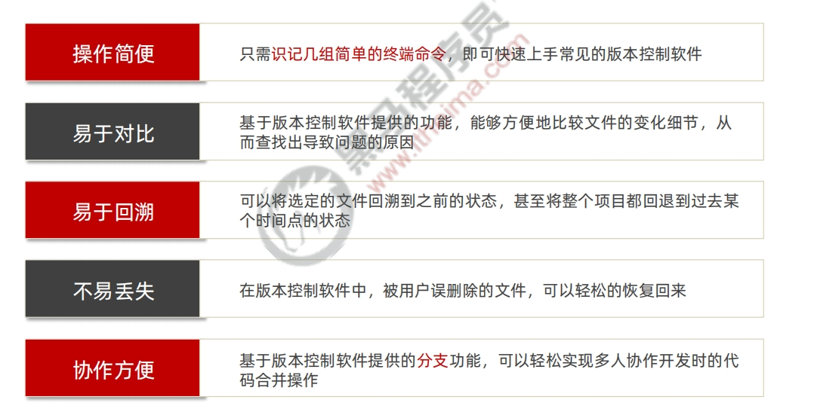

### 3、版本控制系统的分类

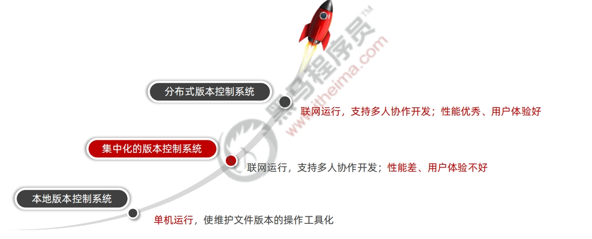
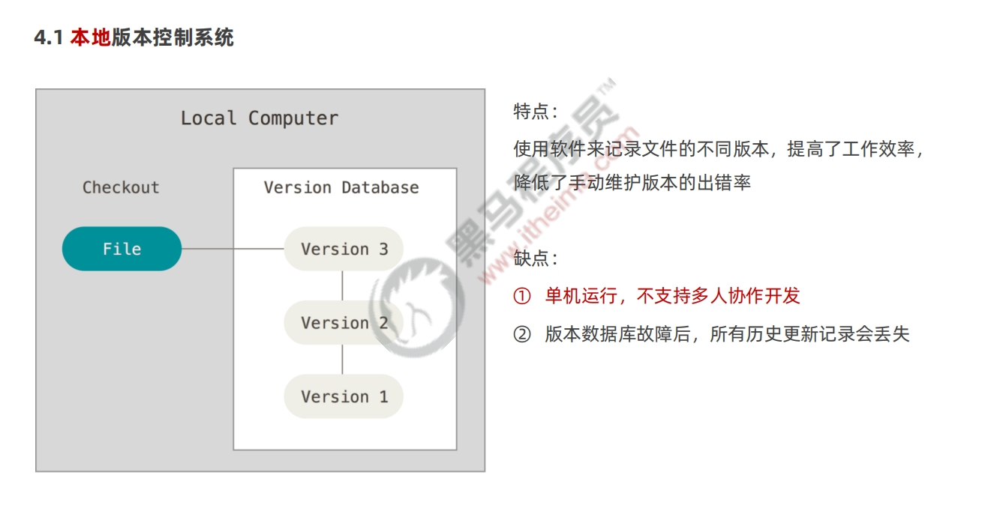
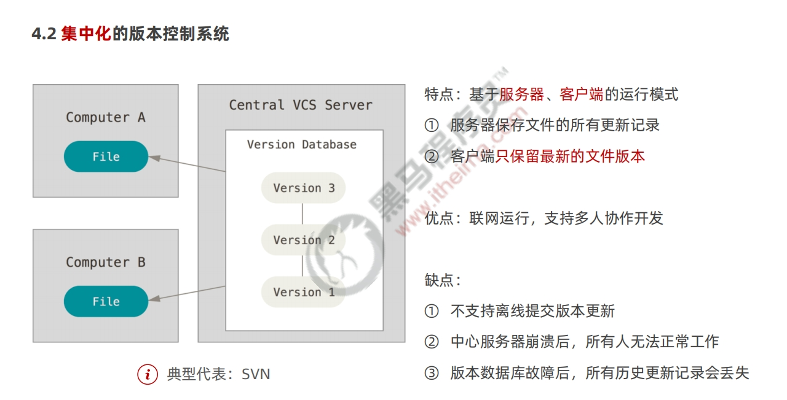
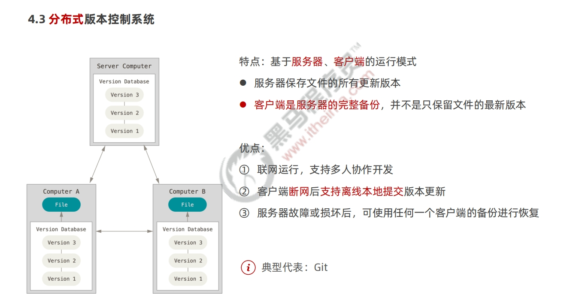

### 4、Git 基本概念

#### (1)git 概念

Git 是一个`开源的分布式版本控制系统`，是目前世界上`最先进、最流行`的版本控制系统。可以快速高效地处理从很小到非常大的项目版本管理。
特点：项目越大越复杂，协同开发者越多，越能体现出 Git 的`高性能`和`高可用性`！

#### （2）git 特性

Git 之所以快速和高效，主要依赖于它的如下两个特性：
① 直接记录快照，而非差异比较
② 近乎所有操作都是本地执行

#### （3）svn 的差异比较

传统的版本控制系统（例如 SVN）是`基于差异`的版本控制，它们存储的是`一组基本文件`和`每个文件随时间逐步累积的差异`。
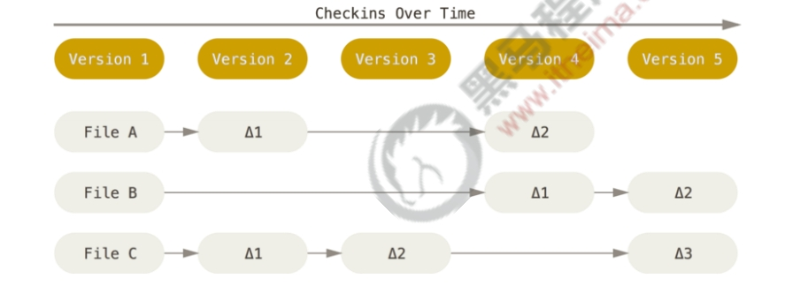

- 好处：节省磁盘空间
- 缺点：`耗时、效率低`
  在每次切换版本的时候，都需要在基本文件的基础上，应用每个差异，从而生成目标版本对应的文件。

#### (4)Git 的记录快照

`Git 快照`是在原有文件版本的基础上重新生成一份新的文件，`类似于备份`。为了效率，如果文件没有修改，Git
不再重新存储该文件，而是只保留一个链接指向之前存储的文件
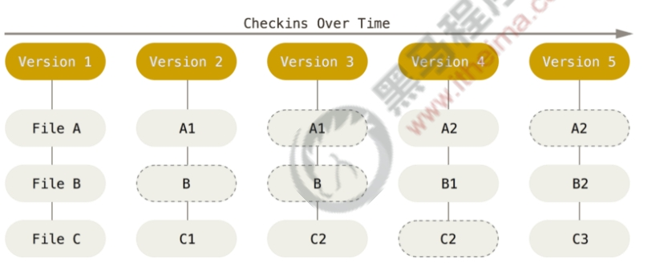

- 缺点：占用磁盘空间较大
- 优点：`版本切换时非常快`，因为每个版本都是完整的文件快照，切换版本时直接恢复目标版本的快照即可。
- 特点：`空间换时间`
- 近乎所有操作都是本地执行
  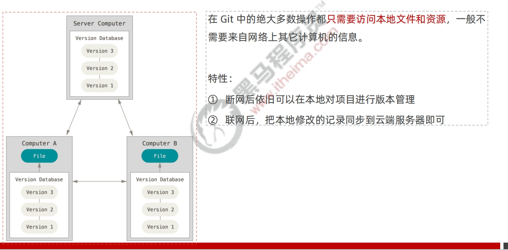

#### （5）git 的三个区域

使用 Git 管理的项目，拥有三个区域，分别是`工作区`、`暂存区`、`Git 仓库`

- 工作区：处理工作的区域
- 暂存区：已完成的工作的`临时存放区域,等待被提交`
- Git 仓库：最终的存放区域

#### （6）Git 中的三种状态

- 已修改 modified:表示修改了文件，但是还没将修改的结果放到暂存区
- 已暂存 staged：表示对已修改文件的当前版本做了标记，使之包含在下次提交的列表中
- 已提交 committed：表示文件已经安全地保存在本地的 Git 仓库中

  注意：</br>
  ⚫ 工作区的文件被修改了，但还没有放到暂存区，就是`已修改`状态。</br>
  ⚫ 如果文件已修改并放入暂存区，就属于`已暂存`状态。</br>
  ⚫ 如果 Git 仓库中`保存着特定版本`的文件，就属于`已提交`状态。</br>

#### (7)基本的 Git 工作流程

  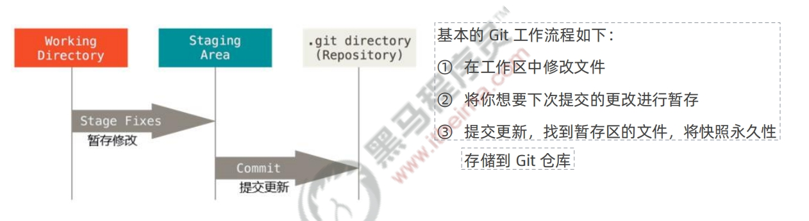

## Git 基础

### 配置用户信息

安装完 Git 之后，要做的第一件事就是设置自己的用户名和邮件地址。因为通过 Git 对项目进行版本管理的时候，Git 需要使用这些基本信息，来记录是谁对项目进行了操作：

```js
git config --global user.name 'luying'
git config --global user.email 'luying@qq.com'
```

注意：如果使用了`--global` 选项，那么该命令只需要运行一次，即可永久生效。
通过 `git config --global user.name` 和 `git config --global user.email` 配置的用户名和邮箱地址，会被写入到 `C:/Users/用户名文件夹/.gitconfig` 文件中。这个文件是 Git 的`全局配置文件，配置一次即可永久生效`。
可以使用记事本打开此文件，从而查看自己曾经对 Git 做了哪些全局性的配置。
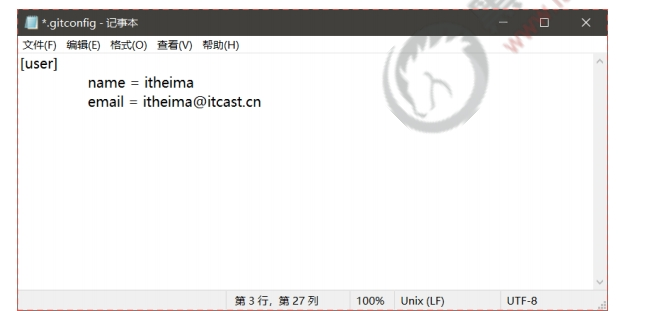

```js
# 查看所有的全局配置项
git config --list --global
# 查看指定的全局配置项
git config user.name
git config user.email

# 打开git config 命令的帮助手册
git help config
# -h 获取简单的help
git config -h
```

### 工作区中文件的 4 种状态

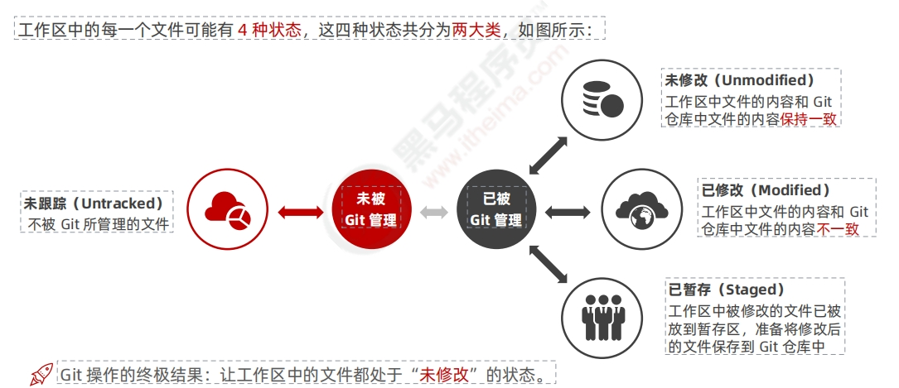

### 一些命令

```js
# 查看文件的状态
git status
# 以精简的方式显示文件状态
git status -s

# 向暂存区添加一个文件
git add index.html
# 向暂存区一次性添加多个文件
git add .
# 提交到git仓库中保存
git commit -m '提交一个index.html文件'

# 撤销对文件的修改
# 撤销对文件的修改指的是：把对工作区中对应文件的修改，`还原`成Git 仓库中所保存的版本。操作的结果：所有的修改会丢失，且无法恢复！`危险性比较高，请慎重操作！`
git checkout -- index.html
`撤销操作的本质`：用Git 仓库中保存的文件，覆盖工作区中指定的文件。

# 取消暂存的文件
git reset HEAD 要移除的文件名称
```

### 跳过使用暂存区域

Git 标准的工作流程是`工作区` → `暂存区` → `Git 仓库`，但有时候这么做略显繁琐，此时可以跳过暂存区，直接将工作区中的修改提交到 Git 仓库，这时候 Git 工作的流程简化为了`工作区` → `Git 仓库`。
Git 提供了一个跳过使用暂存区域的方式，只要在提交的时候，给 `git commit` 加上`-a` 选项，Git 就会自动把所有已经跟踪过的文件暂存起来一并提交，从而跳过 git add 步骤：

```
git commit -a -m '描述信息'
```

### 移除文件

从 Git 仓库中移除文件的方式有两种：</br>
① 从 Git 仓库和工作区中`同时移除`对应的文件</br>
② 只从 Git 仓库中移除指定的文件，但保留工作区中对应的文件</br>

```
# 从 git 仓库和工作区同时移除 index.js文件
git rm -f index.js
# 只从 git 仓库中移除index.js,但保留工作区中的index.js
git rm --cached index.js
```

### 忽略文件

一般我们总会有些文件无需纳入 Git 的管理，也不希望它们总出现在未跟踪文件列表。在这种情况下，我们可以创建一个名为.gitignore 的配置文件，列出要忽略的文件的匹配模式。
文件`.gitignore `的格式规范如下：</br>
① 以`# 开头`的是注释</br>
② 以`/结尾`的是目录</br>
③ 以`/开头`防止递归</br>
④ 以`!开头`表示取反</br>
⑤ 可以使用 `glob 模式`进行文件和文件夹的匹配（glob 指简化了的正则表达式）</br>

所谓的`glob 模式`是指简化了的正则表达式：</br>
①`星号* `匹配`零个或多个任意字符`</br>
②`[abc] `匹配`任何一个列在方括号中的字符`（此案例匹配一个 a 或匹配一个 b 或匹配一个 c）</br>
③`问号?`只`匹配一个任意字符`</br>
④ 在方括号中使用`短划线`分隔两个字符，表示所有在这两个字符范围内的都可以匹配（比如[0-9] 表示匹配所有 0 到 9 的数字）</br>
⑤`两个星号**` 表示`匹配任意中间目录`（比如 a/\*\*/z 可以匹配 a/z 、a/b/z 或 a/b/c/z 等）</br>

举例：

```js
# 忽略所有的a文件
*.a
# 但跟踪所有的 lib.a，即便你在前面忽略了 .a 文件
!lib.
# 只忽略当前目录下的 TODO 文件，而不忽略 subdir/TODO
/TODO
# 忽略任何目录下名为 build 的文件夹
build/
# 忽略 doc/notes.txt，但不忽略 doc/server/arch,txt
doc/*.txt
# 忽略 doc/ 目录及其所有子目录下的 ·pdf 文件
doc/**/*.pdf
```

### 查看提交历史：git log

```js
# 按时间先后顺序列出所有的提交历史，最近的提交排在最上面
git log
# 只展示最新的两条提交历史，数字可以按需进行填写
git log -2

# 在一行上展示最近两条提交历史的信息
git log -2 --pretty=oneline

# 在一行上展示最近两条提交历史的信息，并自定义输出的格式
# %h 提交的简写哈希值%an作者名字
%ar作者修订日期，按多久以前的方式显示
%s提交说明
git log -2 --pretty=format:"%h  %an  %ar %s
```

### 回退到指定的版本

```js
# 在一行上展示所有的提交历史
git log --pretty=oneline
# 使用 git reset --hard 命令，根据指定的提交 ID 回退到指定版本
git reset --hard <CommitID>
# 在旧版本中使用 git reflog --pretty=oneline 命令，查看命令操作的历史
git reflog --pretty=oneline
# 再次根据最新的提交 ID，跳转到最新的版本
git reset --hard <CommitID>
```

## Github

开源项目托管平台：</br>
专门用于`免费存放开源项目源代码的网站`，叫做`开源项目托管平台`。目前世界上`比较出名`的开源项目托管平台主要有以下 3 个：</br>
⚫Github（全球最牛的开源项目托管平台，没有之一）</br>
⚫Gitlab（对代码私有性支持较好，因此企业用户较多）</br>
⚫Gitee（又叫做`码云`，是国产的开源项目托管平台。访问速度快、纯中文界面、使用友好）</br>
注意：以上 3 个开源项目托管平台，只能托管以 Git 管理的项目源代码，因此，它们的名字都以 Git 开头。</br>

## 远程仓库的两种访问方式

Github 上的远程仓库，有两种访问方式，分别是 `HTTPS` 和 `SSH`。它们的区别是：</br>
①HTTPS：`零配置`；但是每次访问仓库时，需要重复输入 Github 的账号和密码才能访问成功</br>
②SSH：`需要进行额外的配置`；但是配置成功后，每次访问仓库时，不需重复输入 Github 的账号和密码</br>
注意：在实际开发中，`推荐使用 SSH 的方式访问远程仓库`。

SSH key:</br>
SSH key 的`作用`：实现本地仓库和 Github 之间`免登录`的`加密数据传输`。</br>
SSH key 的`好处`：免登录身份认证、数据加密传输。</br>
SSH key 由`两部分组成`，分别是：</br>
①id_rsa（私钥文件，存放于客户端的电脑中即可）</br>
②id_rsa.pub（公钥文件，需要配置到 Github 中）</br>

#### 生成 ssh key :

```
ssh-keygen -t rsa -b 4096 -C "your_email@example.com"
```

#### 配置 SSH key

使用记事本打开 id_rsa.pub 文件，复制里面的文本内容</br>
② 在浏览器中登录 Github，点击头像-> Settings-> SSH and GPG Keys -> New SSH key</br>
③ 将 id_rsa.pub 文件中的内容，粘贴到 Key 对应的文本框中</br>
④ 在 Title 文本框中任意填写一个名称，来标识这个 Key 从何而来</br>

# git 分支

### 1. 分支的概念

分支就是科幻电影里面的`平行宇宙`，当你正在电脑前努力学习 Git 的时候，另一个你正在另一个平行宇宙里努力学习 SVN。
如果两个平行宇宙互不干扰，那对现在的你也没啥影响。
不过，在某个时间点，两个平行宇宙合并了，结果，你既学会了 Git 又学会了 SVN！

在进行多人协作开发的时候，为了防止互相干扰，提高协同开发的体验，建议每个开发者都基于分支进行项目功能的开发，例如：

在初始化本地 Git 仓库的时候，Git 默认已经帮我们创建了一个名字叫做 master 的分支。通常我们把这个 master 分支叫做`主分支`。
在实际工作中，master 主分支的作用是：`用来保存和记录整个项目已完成的功能代码`。
因此，不允许程序员直接在 master 分支上修改代码，因为这样做的风险太高，容易导致整个项目崩溃。
由于程序员不能直接在 master 分支上进行功能的开发，所以就有了功能分支的概念。
`功能分支`指的是`专门用来开发新功能的分支`，它是临时从 master 主分支上分叉出来的，当新功能开发且测试完毕后，最终需要合并到 master 主分支上

查看分支命令：

```
git branch
# 创建新分支
git branch 分支名称
# 切换分支
git checkout 分支名
# 快速创建和切换新分支
git checkout -b 分支名称
```

git checkout -b 分支名称" 是下面两条命令的简写形式：
①git branch 分支名称
②git checkout 分支名称

### 合并分支

```
# 1.切换到 master 分支
git checkout master
# 2.在 master 分支上运行 git merge 命令，将 login 分支的代码合并到 master 分支
git merge login
```

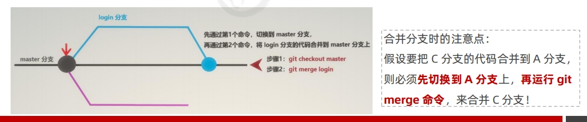
### 删除分支

```
git branch -d 分支名称
```

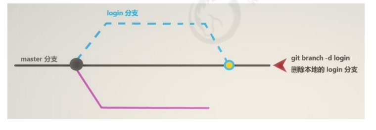

### 遇到冲突时的分支合并

如果在`两个不同的分支`中，对`同一个文件`进行了`不同的修改`，Git 就没法干净的合并它们。此时，我们需要打开这些包含冲突的文件然后`手动解决冲突`。

```js
# 假设:在把 reg 分支合并到 master 分支期间，代码发生了冲突
git checkout master
git merge reg
# 打开包含冲突的文件，手动解决冲突之后，再执行如下的命令
git add
git commit -m "解决了分支合并冲突的问题"
```

### 将本地分支推送到远程仓库

```js
# -u 表示把本地分支和远程分支进行关联，只在第一次推送的时候需要带 -u 参数
git push -u 远程仓库的别名 本地分支名称:远程分支名称
# 实际案例:
git push -u origin payment:pay
# 如果希望远程分支的名称和本地分支名称保持一致，可以对命令进行简化:
git push -u origin payment
```

注意：第一次推送分支需要带`-u 参数`，此后可以直接使用 `git push` 推送代码到远程分支。

### 查看远程仓库中所有的分支列表

通过如下的命令，可以查看远程仓库中，所有的分支列表的信息：

```
git remote show 远程仓库名称
```

### 跟踪分支

跟踪分支指的是：从远程仓库中，把远程分支下载到本地仓库中。需要运行的命令如下：

```
# 从远程仓库中，把对应的远程分支下载到本地仓库，保持本地分支和远程分支名称相同
git checkout 远程分支的名称
# 示例:
git checkout pay
# 从远程仓库中，把对应的远程分支下载到本地仓库，并把下载的本地分支进行重命名
git checkout -b 本地分支名称 远程仓库名称/远程分支名称
# 示例:
git checkout -b payment origin/pay
```

### 拉取远程分支的最新的代码

可以使用如下的命令，把远程分支最新的代码下载到本地对应的分支中：

```
# 从远程仓库，拉取当前分支最新的代码，保持当前分支的代码和远程分支代码一致
git pull
```

### 删除远程分支

可以使用如下的命令，删除远程仓库中指定的分支：

```
 # 删除远程仓库中，指定名称的远程分支
git push 远程仓库名称 --delete 远程分支名称
# 示例:
git push origin --delete pay
```

总结：

```js
能够掌握 Git 中基本命令的使用
git init
git add
git commit -m"提交消息
git status 和 git status -s

能够使用 Github 创建和维护远程仓库
能够配置 Github 的 SSH 访问
能够将本地仓库上传到 Github

能够掌握 Git 分支的基本使用
git checkout -b 新分支名称
git push -u origin 新分支名称
git checkout 分支名称
git branch
```
