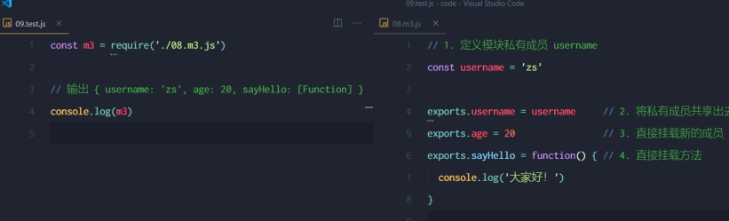

# 模块化的基本概念

### 什么是模块化

编程领域中的模块化，就是`遵守固定的规则`，把一个大文件拆成`独立并互相依赖`的`多个小模块`。</br>
把代码进行模块化拆分的好处：</br>
① 提高了代码的`复用性`</br>
② 提高了代码的`可维护性`</br>
③ 可以实现`按需加载`</br>

### 模块化规范

`模块化规范`就是对代码进行模块化的拆分与组合时，需要遵守的那些规则。</br>
例如：</br>
⚫ 使用什么样的语法格式来`引用模块`</br>
⚫ 在模块中使用什么样的语法格式`向外暴露成员`</br>
`模块化规范的好处`：大家都遵守同样的模块化规范写代码，降低了沟通的成本，极大方便了各个模块之间的相互调用，
利人利己。

# Node.js 中模块的分类

Node.js 中根据模块来源的不同，将模块分为了 3 大类，分别是：</br>
⚫ `内置模块`（内置模块是由 Node.js 官方提供的，例如 fs、path、http 等）</br>
⚫ `自定义模块`（用户创建的每个 .js 文件，都是自定义模块）</br>
⚫ `第三方模块`（由第三方开发出来的模块，并非官方提供的内置模块，也不是用户创建的自定义模块，使用前需要先下载）</br>

### 加载模块

使用强大的 `require()` 方法，可以加载需要的内置模块、用户自定义模块、第三方模块进行使用。例如：

```js
// 1.加载内置的 fs 模块
const fs = require("fs");
// 2.加载用户的自定义模块
const custom = require("./custom.js");
//3、加载第三方模块(关于第三方模块的下载和使用，会在后面的课程中进行专门的讲解)
const moment = require("moment");
```

注意:使用 require()方法加载其它模块时，会执行被加载模块中的代码。

### Node.js 中的模块作用域

#### 1、什么是<font color='red'>模块作用域</font>

和`函数作用域`类似，在自定义模块中定义的变量、方法等成员，`只能在当前模块内被访问`，这种`模块级别的访问限制`，叫做`模块
作用域`。


#### 2、 模块作用域的好处

防止了全局变量污染的问题


#### 2、向外共享模块作用域中的成员

1. module 对象

在每个 .js 自定义模块中都有一个 module 对象，它里面存储了和当前模块有关的信息，打印如下：


2. module.exports 对象
   在自定义模块中，可以使用 module.exports 对象，将模块内的成员共享出去，供外界使用。</br>
   外界用 `require()` 方法导入自定义模块时，得到的就是 module.exports 所指向的对象</br>
   使用 require() 方法导入模块时，导入的结果，永远以 module.exports 指向的对象为准</br>

3. exports 对象
   由于 module.exports 单词写起来比较复杂，为了简化向外共享成员的代码，Node 提供了 exports 对象。默认情况
   下，`exports 和 module.exports 指向同一个对象`。最终共享的结果，还是以 module.exports 指向的对象为准

   

4. exports 和 module.exports 的使用误区
   时刻谨记，require() 模块时，得到的永远是 module.exports 指向的对象：
   
   注意：为了防止混乱，建议大家不要在同一个模块中同时使用 exports 和 module.exports

#### 3、 Node.js 中的模块化规范

Node.js 遵循了 CommonJS 模块化规范，CommonJS 规定了`模块的特性`和`各模块之间如何相互依赖`。
CommonJS 规定：
① 每个模块内部，`module 变量`代表当前模块。
② module 变量是一个对象，它的 exports 属性（即` module.exports）是对外的接口`。
③ 加载某个模块，其实是加载该模块的 module.exports 属性。`require() 方法用于加载模块`。

# 模块的加载机制

### 1、优先从缓存中加载

`模块在第一次加载后会被缓存`。 这也意味着多次调用 require() 不会导致模块的代码被执行多次。
注意：不论是内置模块、用户自定义模块、还是第三方模块，它们都会优先从缓存中加载，从而`提高模块的加载效率`

### 2、 内置模块的加载机制

内置模块是由 Node.js 官方提供的模块，`内置模块的加载优先级最高`。
例如，require('fs') 始终返回内置的 fs 模块，即使在 node_modules 目录下有名字相同的包也叫做 fs。

### 3、自定义模块的加载机制

使用 require() 加载自定义模块时，必须指定以 ./ 或 ../ 开头的路径标识符。在加载自定义模块时，如果没有指定 ./ 或 ../
这样的路径标识符，则 node 会把它当作内置模块或第三方模块进行加载。</br>
同时，在使用 require() 导入自定义模块时，如果省略了文件的扩展名，则 Node.js 会按顺序分别尝试加载以下的文件：</br>
① 按照确切的文件名进行加载</br>
② 补全 .js 扩展名进行加载</br>
③ 补全 .json 扩展名进行加载</br>
④ 补全 .node 扩展名进行加载</br>
⑤ 加载失败，终端报错</br>

### 4、第三方模块的加载机制

如果传递给 require() 的模块标识符不是一个内置模块，也没有以 ‘./’ 或 ‘../’ 开头，则 Node.js 会从当前模块的父
目录开始，尝试从 /node_modules 文件夹中加载第三方模块。</br>
如果没有找到对应的第三方模块，则移动到再上一层父目录中，进行加载，直到文件系统的根目录。</br>
例如，假设在 'C:\Users\itheima\project\foo.js' 文件里调用了 require('tools')，则 Node.js 会按以下顺序查找：</br>
① C:\Users\itheima\project\node_modules\tools</br>
② C:\Users\itheima\node_modules\tools</br>
③ C:\Users\node_modules\tools</br>
④ C:\node_modules\tools</br>

### 5、目录作为模块

当把目录作为模块标识符，传递给 require() 进行加载的时候，有三种加载方式：</br>
① 在被加载的目录下查找一个叫做 package.json 的文件，并寻找 main 属性，作为 require() 加载的入口</br>
② 如果目录里没有 package.json 文件，或者 main 入口不存在或无法解析，则 Node.js 将会试图加载目录下的 index.js 文件。</br>
③ 如果以上两步都失败了，则 Node.js 会在终端打印错误消息，报告模块的缺失：Error: Cannot find module 'xxx'</br>
