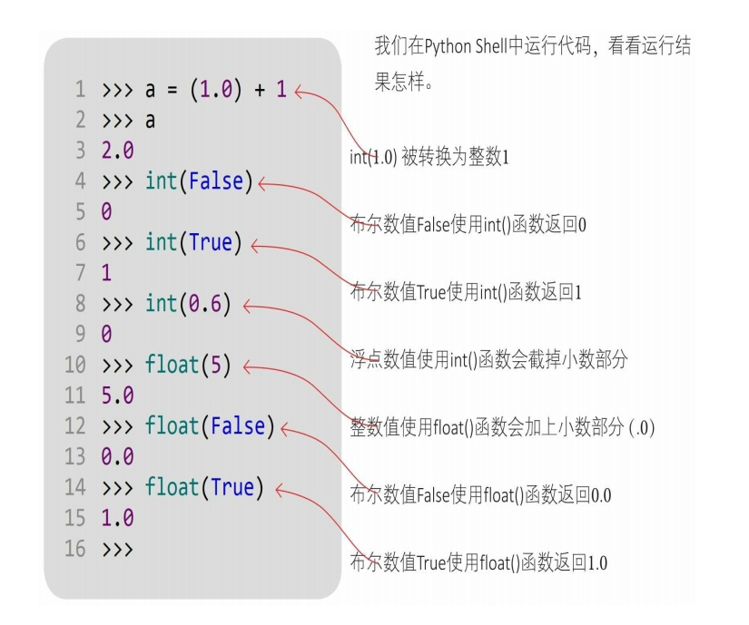
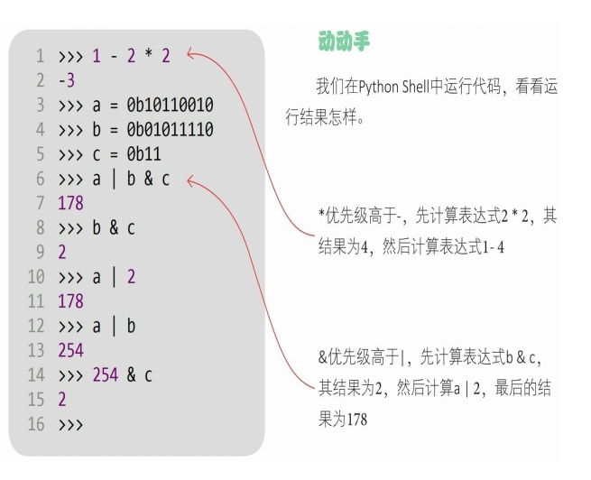
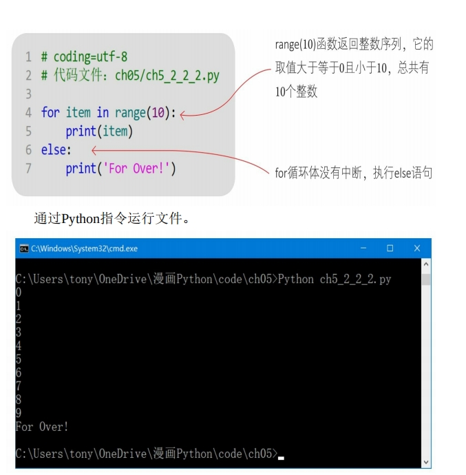

### 1、Python 的特点

Python 之所以受到大家的欢迎，是因为它有很多优秀“品质”。

1. 简单、易学、免费、开源：Python 简单、易学。我们可以自由发
   布其复制版本，阅读、修改其源代码，将其（部分）用于新软件中。
2. 解释型：Python 是边解释边执行的，Python 解释器会将源代码转
   换为中间字节码形式，然后将其解释为机器语言并执行。
3. 可移植：Python 解释器已被移植在许多平台上，Python 程序无须
   经过修改就可以在多个平台上运行。
4. 代码规范：Python 所采用的强制缩进的方式，使得其代码具有极
   佳的可读性。
5. 面向对象：与 C++和 Java 等相比，Python 以强大而简单的方式实
   现了面向对象编程。
6. 胶水语言：标准版本的 Python 调用 C 语言，并可以借助 C 语言的接
   口驱动调用所有编程语言。
7. 丰富的库：Python 的标准库种类繁多，可以帮助处理各种工作，
   我们不需要安装就可以直接使用这些库。
8. 动态类型：Python 不会检查数据类型，在声明变量时不需要指定
   数据类型。

### 二、编程基础

#### 2.1 标识符

标识符就是变量、函数、属性、类、模块等可以由程序员指定名称的代码元素。
构成标识符的字符均遵循一定的命名规则。

> Python 中标识符的命名规则如下。

1. 区分大小写：Myname 与 myname 是两个不同的标识符。
2. 首字符可以是下画线（\_）或字母，但不能是数字。
3. 除首字符外的其他字符必须是下画线、字母和数字。
4. 关键字不能作为标识符。
5. 不要使用 Python 的内置函数作为自己的标识符。

> 在很多编程语言中，中文等亚洲文字都可以作为标识符，在 Python 中也可以吗?
> 可以。因为 Python 3 的字符采用了双字节 Unicode 编码。Unicode 叫作统一编码制，包含了亚洲文字编码，如中文、日文、韩文等字符。
> 注 Unicode 是国际组织制定的可以容纳世界上所有文字和符号的字符编码方案。

#### 2.2 关键字

关键字是由语言本身定义好的有特殊含义的代码元素。

#### 2.3 变量

在 Python 中为一个变量赋值的同时就声明了该变量，该变量的数据类型就是赋值数据所属的类型，该变量还可以接收其他类型的数据。

#### 2.4 语句

Python 代码是由关键字、标识符、表达式和语句等构成的，语句是代码的重要组成部分。
在 Python 中，一行代码表示一条语句，在一般情况下语句结束时不加分号。示例代码：

#### 2.5 代码注释

在使用＃（井号）时，＃位于注释行的开头，＃后面有一个空格，接着是注释的内容。

#### 2.6 模块

在 Python 中一个模块就是一个文件，模块是保存代码的最小单位，在模块中可以声明变量、函数、属性和类等 Python 代码元素。

> import ＜模块名＞：通过这种方式会导入 m2 模块的所有代码元素,在访问时需要加前缀“m2.”

> from＜模块名＞import＜代码元素＞：通过这种方式会导入m2中的x变量，在访问时不需要加前缀“m2.”

> from ＜模块名＞ import ＜代码元素＞ as ＜代码元素别名＞：与 ② 类似，在当前 m1 模块的代码元素（x 变量）与要导入的 m2 模块的代码元素（x 变量）名称有冲突时，可以给要导入的代码元素（m2 中的 x）一个别名 x2

### 三、第 3 章 数字类型的数据

#### 3.1 Python 中的数据类型

在 Python 中所有的数据类型都是类，每个数据值都是类的“实例”。 
在 Python 中有 6 种主要的内置数据类型：`数字、字符串、列表、元组、集合和字典`。`列表、元组、集合和字典`可以容纳多项数据，在本书中把它们统称为`容器类型`的数据。 
Python 中的数字类型有 4 种：`整数类型、浮点类型、复数类型和布尔类型`。需要注意的是，布尔类型也是数字类型，它事实上是整数类型
的一种。 

#### 3.2 整数类型

Python 中的`整数类型`为`int类`，整数类型的范围可以很大，表示很大的整数，只受所在计算机硬件的限制。

#### 3.3 浮点类型

浮点类型主要用来存储`小数数值`，Python 的浮点类型为`float类`。Python 只支持`双精度浮点类型`，而且是与本机相关的。

#### 3.4 复数类型

整数和浮点数（小数）在数学中被统称为`实数`。与实数对应的是`复数`，复数在数学中被表示为：`a+bi`，其中 `a 被称为实部，b 被称为虚部，i 被称为虚数单位`。复数在数学、理论物理学和电气工程等方面应用广泛，例如向量就可以使用复数表示

#### 3.5 布尔类型

Python 中的布尔类型为`bool类`，`bool是int的子类`，它只有两个值: `True和False`。

#### 3.6 数字类型的相互转换

> Python 中的很多数据类型都可以相互转换，但是具体情况比较复杂，本章重点介绍数字类型之间的相互转换。
> 在 Python 的数字类型中，除复数外，其他三种数字类型如整数、浮点和布尔都可以相互转换，分为隐式类型的转换和显式类型的转换。

##### 3.6.1 隐式类型的转换

数字之间可以进行数学计算，在进行数学计算时若数字类型不同，则会发生隐式类型的转换。

##### 3.6.2 显式类型的转换

> 表达式 1.0 + 1 中的整数 1 被隐式转换为浮点数 1.0，但在很多情况下我都希望浮点数 1.0 被转换为整数 1，该怎么办?
> 在这种情况下就需要使用转换函数进行显式转换了。除复数外，三种数字类型如`整数、浮点和布尔`都有自己的转换函数，分别是` int()、float() 和 bool()` 函数，
> 

### 四、第 4 章 运算符

#### 4.1 算术运算符

算术运算符用于组织整数类型和浮点类型的数据，有`一元运算符`和`二元运算符`之分。一元算术运算符有两个：`+（正号）和-（负号）`，例如：+a 还是 a，-a 是对 a 的取反运算。

#### 4.2 比较运算符

比较运算符用于比较两个表达式的大小，其结果是布尔类型的数据，即`True`或`False`。

> 数字类型的数据可以使用比较运算符进行比较，其他类型的数据也可以吗?
> 比较运算符可用于任意类型的数据，但参与比较的两种类型的数据要相互兼容，即能进行隐式转换。例如: 整数、浮点和布尔这三种类型是相互兼容的

#### 4.3 逻辑运算符

逻辑运算符用于对布尔型变量进行运算，其结果也是布尔型

#### 4.4 位运算符

`位运算`是以二进位（bit）为单位进行运算的，`操作数和结果`都是`整数类型`的数据。

#### 4.5 赋值运算符

#### 4.6 运算符的优先级

### 五、第 5 章 程序流程控制

分支语句，跳转语句，循环语句

#### 5.1 分支语句

> 我很熟悉分支语句，它也被称为条件语句，Java 和 C 等很多编程语言都有判断语句 if 和多分支语句 switch，在 Python 中也有吗?
> Python 的设计理念是简单、刚好够用，所以在 Python 中没有 switch 语句，多分支功能是通过 if-elif-else 实现的。

#### 5.2 循环语句

Python 支持两种循环语句：while 和 for。

##### 5.2.1 while 语句

> 在 Java 和 C 中都有 while 和 do-while 语句，在 Python 中也有吗?
> 在 Python 中只有 while 语句，没有 do-while 语句。while 语句先判断循环条件，若条件为 True 则执行循环体。 

##### 5.2.2 for 语句

#### 5.3 跳转语句

> 跳转语句能够改变程序的执行顺序，包括 break、continue 和 return。`break 和 continue 用于循环体`中，而 return 用于函数中。本节先介绍 break 和 continue 语句，对于 return 语句，将在后面的章节中介绍。 

##### 5.3.1 break 语句

break 语句用于强行退出循环体，不再执行循环体中剩余的语句 

##### 5.3.2 continue 语句

continue 语句用于`结束本次循环`，`跳过循环体中尚未执行的语句，接着进行终止条件的判断，以决定是否继续循环`。 

### 六、第 6 章 容器类型的数据

若我们想将多个数据打包并且统一管理，应该怎么办？
Python 内置的数据类型如`序列（列表、元组等）、集合和字典`等可以容纳多项数据，我们称它们为容器类型的数据。

#### 6.1 序列

序列（sequence）是一种`可迭代的、元素有序`的容器类型的数据。
序列包括`列表（list）、字符串（str）、元组（tuple）和字节序列（bytes）`等。

##### 6.1.1 序列的索引操作

 
序列中的元素都是有序的，每一个元素都带有序号，这个序号叫作索引。索引有正值索引和负值索引之分。 
我们是通过下标运算符访问序列中的元素的，下标运算符是跟在容器数据后的一对中括号（[]），中括号带有参数，对于序列类型的数据，这个参数就是元素的索引序号。

##### 6.1.2 加和乘操作

加（+）和乘（ \* ）运算符也可以用于序列中的元素操作。加（+）运算符可以将两个序列连接起来，乘（\_）运算符可以将两个序列重复多次。 

##### 6.1.3 切片操作

序列的切片（Slicing）就是从序列中切分出小的子序列。 
切片运算符的语法形式为[start：end：step]。其中，`start是开始索引，end是结束索引，step是步长`（切片时获取的元素的间隔，可以为正整数，也可以为负整数）。 
切下的小切片包括 start 位置的元素，但不包括 end 位置的元素，start 和 end 都可以省略 

下面对字符串变量 a 进行切片操作[0：3：2]，开始索引为 0，结束索引为 3，步长为 2。
我们在 Python Shell 中运行没有省略步长的示例代码，看看运行结果怎样。

##### 6.1.4 成员测试

成员测试运算符有两个：`in`和`not in`，`in用于测试是否包含某一个元素`，`not in用于测试是否不包含某一个元素` 

#### 6.2 列表

列表（list）是一种`可变序列类型`，我们可以`追加、插入、删除和替换`列表中的元素。 

##### 6.2.1 创建列表

创建列表有两种方法。

1. list（iterable）函数：参数 iterable 是可迭代对象（`字符串、列表、元组、集合和字典`等）。
2. [元素 1，元素 2，元素 3，⋯]：指定具体的列表元素，元素之间以逗号分隔，列表元素需要使用中括号括起来

#### 6.2.2 追加元素

列表是可变的序列对象，列表可以追加元素。

1. 在列表中追加单个元素时，可以使用列表的 append（x）方法。
2. 在列表中追加多个元素时，可以使用加（+）运算符或列表的 extend（t）方法

#### 6.2.3 插入元素

想向列表中插入元素时，可以使用列表的`list.insert（i，x）`方法，其中，`i指定索引位置`，`x是要插入的元素`。

#### 6.2.4 替换元素

想替换列表中的元素时，将列表下标索引元素放在赋值符号（=）的左边，进行赋值即可。

#### 6.2.5 删除元素

想在列表中删除元素时，可使用列表的 list.remove（x）方法，如果找到匹配的元素 x，则删除该元素，如果找到多个匹配的元素，则只删除第一个匹配的元素

#### 6.3 元组

元组（tuple）是一种不可变序列类型。

#### 6.3.1 创建元组

创建元组时有两种方法。

1. tuple（iterable）函数：参数 iterable 是可迭代对象（字符串、列表、元组、集合和字典等）。
2. （元素 1，元素 2，元素 3，⋯）：指定具体的元组元素，元素之间以逗号分隔。对于元组元素，可以使用小括号括起来，也可以省略小括号。

#### 6.3.2 元组拆包

创建元组，并将多个数据放到元组中，这个过程被称为`元组打包`。与元组打包相反的操作是`拆包`，就是`将元组中的元素取出，分别赋值给不同的变量`。 

#### 6.4 集合

集合（set）是一种可迭代的、无序的、不能包含重复元素的容器类型的数据。

##### 6.4.1 创建集合

序列中的元素是有序的; 集合中的元素是无序的，但元素不能重复。
我们可以通过以下两种方式创建集合。

1. set（iterable）函数：参数 iterable 是可迭代对象（字符串、列表、元组、集合和字典等）。
2. {元素 1，元素 2，元素 3，⋯}：指定具体的集合元素，元素之间以逗号分隔。对于集合元素，需要使用大括号括起来。

##### 6.4.2 修改集合

- 修改集合类似于修改列表，可以向其中插入和删除元素。修改可变集合有如右所示的常用方法。
- add（elem）：添加元素，如果元素已经存在，则不能添加，不会抛出错误。
- remove（elem）：删除元素，如果元素不存在，则抛出错误。
- clear（）：清除集合

##### 6.5 字典

- 字典（dict）是可迭代的、通过键（key）来访问元素的可变的容器类型的数据。
- 字典由两部分视图构成：键视图和值视图。键视图不能包含重复的元素，值视图能。在键视图中，键和值是成对出现的。

